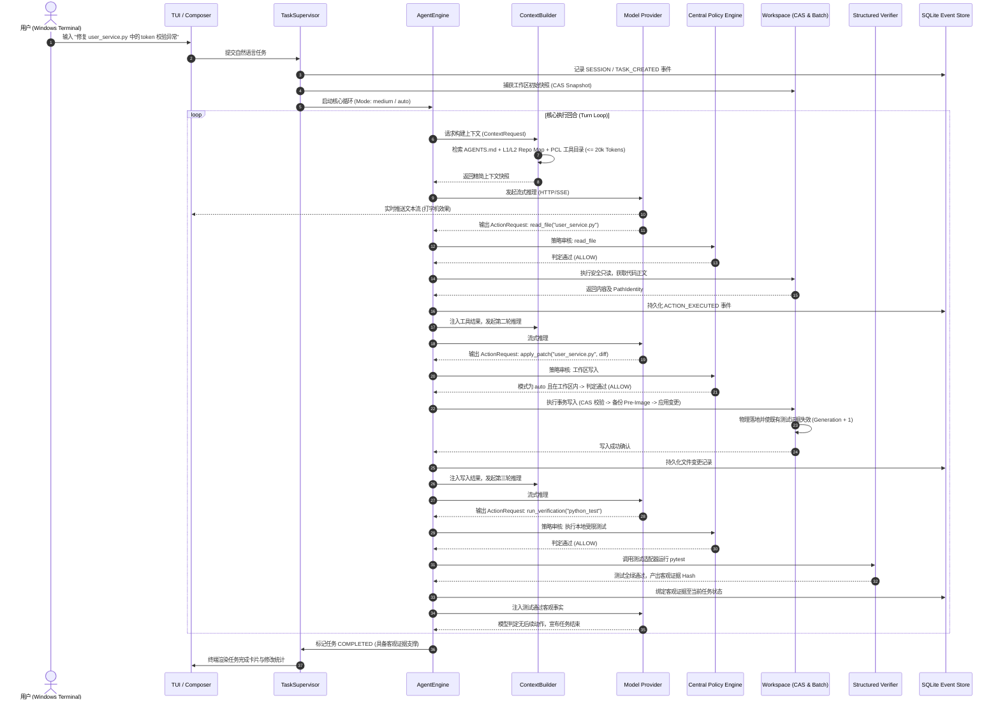

# Chaos Agent 项目全系统深度技术解析报告

> **文档版本**：v1.1.0-Architecture-DeepDive
> **项目基线**：Chaos Agent v1.0.3+（对齐 2026 年最新架构演进）
> **代码规模度量**：Python 源码 738 文件 / 95,303 行；测试套件 345 文件 / 47,113 行；总规模逾 142,000 行。
> **文档受众**：架构师、核心研发人员、智能体安全研究员及平台集成工程师。

---

## 1. 项目定位、背景与核心哲学

### 1.1 项目定位

**Chaos Agent** 是一个以 **Windows-First** 为基石、采用 **Python** 全自研实现的生产级自主编码智能体（Autonomous Coding Agent）。它专为高复杂度、长执行链、需要深度调用本地操作系统工具的软件工程研发任务而设计。

它不是一个简单的“单文件提示词套壳”或“简单的 LLM 问答脚本”，而是一个具备**完整操作系统进程管控、事务级文件编辑、内容寻址快照回滚、细粒度策略防护、渐进式能力披露、以及确定性上下文预算控制**的工业级 Agent 系统。

### 1.2 净室设计（Clean-Room Implementation）与演进脉络

Chaos Agent 属于完全独立的净室实现。在架构设计上，它批判性地吸收了业界诸多代表性项目的成败经验：

- **吸取 uv-agent / Aider 的优点**：采纳了基于 Git 仓库地图与上下文精简调优的思想，但抛弃了“代码修改不可逆”与“依赖粗糙 Git 提交管理历史”的局限，建立了独立的 CAS 文件系统事务；
- **吸取 OpenCode / OpenHands / Goose 的教训**：摒弃了对外部环境权限过度放任的假设，建立了所有副作用必须通过**中央策略引擎（Policy Engine）**与**客观验证门禁（Structured Verifiers）**的硬约束；
- **借鉴 URI Agent（Rust）的前沿突破**：在 2026 年 9 月的演进中，系统针对 URI Agent 展现出的“能力按需展开”特性，首创实现了 **PCL（Progressive Capability Leasing，渐进能力租约）** 架构，将工具披露与上下文解耦，极大降低了常驻上下文 Token 开销，并实现了 ACP（Agent Client Protocol v1）编辑器协议接入。

### 1.3 核心设计哲学五大铁律

1. **最小特权与默认闭合（Fail-Closed Policy Baseline）**：
   系统绝不信任大模型的道德声明或自觉性。所有涉及物理磁盘写操作、进程启动、网络外联、敏感配置读取的操作，必须统一经过宿主仲裁。凡未声明、无法识别或越界的操作，一律直接抛出策略拒绝（DENY），宁可失败也不越权。
2. **绝对的 Windows 进程所有权（Process Ownership via Job Objects）**：
   区别于绝大多数视 Windows 为“二等公民”的 Agent，Chaos Agent 深度绑定 Windows 内核机制：挂起创建进程、强制绑定 Job Object、开启 `KILL_ON_JOB_CLOSE`、精准识别 PowerShell 双方言与纯净管道流，杜绝任何僵尸进程逃逸。
3. **事务性工作区变更与无损后悔权（Transactional CAS & Arbitrary Rewind）**：
   文件写入采用乐观锁与原子批次机制，支持崩溃恢复；系统具备“内容寻址快照”与“双观察投影”，允许用户在代码仓库、对话会话或二者之间执行无损、可逆的高精度回滚。
4. **渐进式能力披露（Progressive Capability Leasing）**：
   工具 Schema 不在启动时一次性灌入 Prompt。核心只读工具默认常驻，高阶工具仅暴露轻量摘要；模型需显式发起租约申请，在下一轮推理边界按需注入完整 Schema，且 Schema 一旦变更则租约自动失效。
5. **客观证据终结自述欺骗（Objective Verifier over Self-Reporting）**：
   模型自称“代码已修复且通过测试”在系统内不具备任何效力。任务的成功标记必须由宿主控制的验证适配器运行真实测试并生成具备时间代际（Generation）绑定的客观证据链。

---

## 2. 工程全景度量与模块拓扑

### 2.1 代码规模与物理布局

经过全代码库的递归统计，项目代码构成如下：

| 目录 / 子系统                          |  Python 文件数  |  代码行数 (LOC)  | 核心职责                                                          |
| :------------------------------------- | :-------------: | :---------------: | :---------------------------------------------------------------- |
| `src/code_agent/workspace`           |       130       |      18,387      | CAS 文件系统、原子批次变更、逆向回滚、崩溃对齐恢复                |
| `src/code_agent/interfaces`          |       123       |      13,958      | 终端 UI 组件、Command Picker、Diff 查看器、输入缓冲               |
| `src/code_agent/sessions`            |       94       |      13,566      | SQLite WAL 事件溯源、会话状态机、数据模型、数据迁移               |
| `code_agent_win`                     |       80       |      10,816      | Windows 终端宿主集成、应用启动器、CLI 入口、ACP 适配              |
| `src/code_agent/context`             |       50       |       7,243       | 20k Token 预算引擎、分级仓库地图、Python AST 语义切片             |
| `src/code_agent/runtime`             |       35       |       5,404       | Win32 Job Object、PowerShell 双引擎包装、`run_process_v1`       |
| `src/code_agent/core`                |       45       |       5,295       | Agent 主循环引擎、回合驱动、取消树、任务状态持久化                |
| `src/code_agent/providers`           |       23       |       3,336       | OpenAI Responses、Chat Completions、Anthropic Messages 流式客户端 |
| `src/code_agent/evaluation`          |       23       |       2,690       | 40 场景 Replay 评测框架、防篡改跟踪、沙箱执行器                   |
| `src/code_agent/policy`              |       15       |       2,159       | 集中式策略引擎、路径分类防护、命令白名单匹配                      |
| `src/code_agent/thread_intelligence` |       16       |       1,559       | 语义检查点提取、跨线程安全搜索与读取                              |
| `src/code_agent/plugins`             |       13       |       1,488       | 声明式 JSON 插件加载、Manifest 摘要校验、隔离调度                 |
| `src/code_agent/orchestration`       |       10       |       1,404       | 任务模式冻结、子 Agent（Oracle/Review/Search）受控派发            |
| `src/code_agent/attachments`         |       12       |       1,245       | 剪贴板图像多模态解析、Bitmap 抓取与内容寻址存储                   |
| `src/code_agent/checkpoints`         |       10       |       1,210       | 内容寻址快照存储（CAS Blob Store）、清单比较                      |
| `src/code_agent/verification`        |       11       |        852        | 单元测试适配器、构建门禁、Generation 证据失效流                   |
| `src/code_agent/workflows`           |        7        |        855        | 只读有向无环图（Workflow DAG）、执行因果链持久化                  |
| `src/code_agent/peers`               |        6        |        849        | 同机跨会话 4KiB 纯文本网格通信路由器                              |
| `src/code_agent/acp`                 |        7        |        653        | Agent Client Protocol v1 Stdio JSON-RPC 通信实现                  |
| `src/code_agent/mcp`                 |        7        |        450        | Model Context Protocol Stdio 客户端与风险桥接                     |
| `src/code_agent/config`              |        8        |        754        | TOML 级联配置解析、环境变量重载、运行时配置覆盖                   |
| `src/code_agent/capabilities`        |        3        |        345        | 渐进式能力目录、契约动态加载器、Schema 摘要管理                   |
| `src/code_agent/skills`              |        4        |        276        | 技能目录发现、SKILL.md 摘要冻结与激活快照                         |
| **单元与集成测试套件**           |  **345**  | **47,113** | 各 Feature 独立 unittest 套件 + 根目录集成回归套件                |
| **总计**                         | **1,083** | **142,416** | **全栈纯 Python 严密工业级实现**                            |

### 2.2 核心依赖选型

项目严格精简第三方依赖，仅引入经过充分验证的高稳定性底层库（见 `pyproject.toml`）：

- `agent-client-protocol>=0.12,<0.13`：标准化 ACP 编辑器协议支持；
- `httpx>=0.28,<0.29`：异步/同步兼容的高性能 HTTP/SSE 模型推理流式交互；
- `mcp>=1.0,<2`：官方 Model Context Protocol 协议支持；
- `Pillow>=10,<12`：跨格式剪贴板图像解码、尺寸规范化与视觉输入支持；
- `psutil>=5.9`：跨平台进程树辅助探测与资源统计；
- `regex>=2024.0`：高性能正则表达式处理；
- `tomli>=2.0,<3`：强类型 TOML 配置文件解析。

---

## 3. 全局分层系统架构与数据流图

### 3.1 核心分层架构

```
┌────────────────────────────────────────────────────────────────────────────────────────┐
│                                 表现层 (Presentation Layer)                            │
│  ┌───────────────────────┐  ┌──────────────────────┐  ┌─────────────────────────────┐  │
│  │ Windows Terminal TUI  │  │ CLI / JSON Headless  │  │  ACP v1 Editor Adapter      │  │
│  │ (追加式转录/Composer)  │  │ (chaos-agent ask/run)│  │  (chaos-agent-acp / Stdio)  │  │
│  └──────────┬────────────┘  └──────────┬───────────┘  └──────────────┬──────────────┘  │
└─────────────┼──────────────────────────┼─────────────────────────────┼─────────────────┘
              ▼                          ▼                             ▼
┌────────────────────────────────────────────────────────────────────────────────────────┐
│                              编排与核心引擎层 (Orchestration & Core)                    │
│  ┌──────────────────────────────────────────────────────────────────────────────────┐  │
│  │ TaskSupervisor / AgentEngine (核心回合循环、Token 预算分配、动态取消树、任务状态机) │  │
│  └──────────┬──────────────────────────┬─────────────────────────────┬──────────────┘  │
│             │                          │                             │                 │
│             ▼                          ▼                             ▼                 │
│  ┌────────────────────┐  ┌────────────────────────┐  ┌──────────────────────────────┐  │
│  │ Task Mode Profiles │  │ Subagents / Delegation │  │ Progressive Tool Catalog     │  │
│  │ (low/med/high/ultra)  │ (Oracle/Review/Search) │  │ (hybrid/progressive/legacy) │  │
│  └────────────────────┘  └────────────────────────┘  └──────────────────────────────┘  │
└────────────────────────────────────────┬───────────────────────────────────────────────┘
                                         ▼
┌────────────────────────────────────────────────────────────────────────────────────────┐
│                              上下文与智能层 (Context & Intelligence)                   │
│  ┌──────────────────────┐  ┌──────────────────────┐  ┌──────────────────────────────┐  │
│  │ Token Budget Engine  │  │ Tiered Repo Map (L0-2)│ │ Hierarchical Rules           │  │
│  │ (20k Token 上限管控) │  │ (Python AST 语义切片)│  │ (AGENTS.md 发现与预算硬截断) │  │
│  └──────────────────────┘  └──────────────────────┘  └──────────────────────────────┘  │
│  ┌──────────────────────────────────────────────────────────────────────────────────┐  │
│  │ Semantic Compaction (语义压缩与确定性摘要降级备选)                                 │  │
│  └──────────────────────────────────────────────────────────────────────────────────┘  │
└────────────────────────────────────────┬───────────────────────────────────────────────┘
                                         ▼
┌────────────────────────────────────────────────────────────────────────────────────────┐
│                              策略与安全守门层 (Policy & Governance)                     │
│  ┌──────────────────────────────────────────────────────────────────────────────────┐  │
│  │ Central Policy Engine (中央策略引擎: 权限模式 auto/plan/ask/elevated/unrestricted) │  │
│  ├──────────────────────────────────┬───────────────────────────────────────────────┤  │
│  │ Path Classification Guard        │ Command Rule Persisted Store                  │  │
│  │ (工作区限制/敏感文件/.git/符号链接)│ (/权限 允许命令 规则精确匹配)                  │  │
│  └──────────────────────────────────┴───────────────────────────────────────────────┘  │
└────────────────────────────────────────┬───────────────────────────────────────────────┘
                                         ▼
┌────────────────────────────────────────────────────────────────────────────────────────┐
│                             执行与隔离层 (Execution & Isolation)                       │
│  ┌──────────────────────────────────────────────────────────────────────────────────┐  │
│  │ Windows Process Runtime                                                          │  │
│  │ ├─ Windows Job Object (KILL_ON_JOB_CLOSE, 挂起创建, 进程树绝对控制)              │  │
│  │ ├─ PowerShell Runtime (PS7 / WinPS 5.1 自动探测, 专用 UTF-8 包装脚本)            │  │
│  │ └─ run_process_v1 (无 Shell 展开的严格 argv 原语)                                │  │
│  ├──────────────────────────────────┬───────────────────────────────────────────────┤  │
│  │ Transactional Workspace Editing  │ Structured Verifier Framework                 │  │
│  │ (CAS 比较替换, 批次提交/回滚/恢复)│ (单元测试/构建执行, Generation 证据链绑定)     │  │
│  └──────────────────────────────────┴───────────────────────────────────────────────┘  │
└────────────────────────────────────────┬───────────────────────────────────────────────┘
                                         ▼
┌────────────────────────────────────────────────────────────────────────────────────────┐
│                               持久化与存储层 (Persistence & Storage)                   │
│  ┌──────────────────────┐  ┌──────────────────────┐  ┌──────────────────────────────┐  │
│  │ SQLite WAL Sessions  │  │ Content-Addressed    │  │ Peer Session Messaging       │  │
│  │ (事件流、线程与任务) │  │ Snapshot Store (Blobs│  │ (跨会话 4KiB 纯文本通信网格) │  │
│  └──────────────────────┘  └──────────────────────┘  └──────────────────────────────┘  │
└────────────────────────────────────────────────────────────────────────────────────────┘
```

---

## 4. 十一大核心子系统源码级深度剖析

### 4.1 Windows 原生进程运行时与作业控制 (`code_agent.runtime`)

在 Windows 系统中，智能体随意调用 `subprocess.Popen("powershell -Command ...")` 极其脆弱：极易遭遇管道阻塞死锁、ANSI 字符错乱、子进程孤儿化脱离、编码歧义等问题。Chaos Agent 在 `src/code_agent/runtime` 实现了高可靠执行底座。

#### 4.1.1 Windows Job Object 内核级绑定

实现位于 `_windows_job.py` 与 `_windows_spawn.py`：

- **挂起启动（Suspended Launch）**：通过 Win32 API `CreateProcessW` 创建子进程时强制传入 `CREATE_SUSPENDED`（`0x00000004`）标志。此时主线程在进入入口点前被冻结。
- **原子关联 Job Object**：调用 `AssignProcessToJobObject` 将该新进程挂载到预先配置好的作业对象中。该作业对象通过 `SetInformationJobObject` 注入了 `JobObjectExtendedLimitInformation`，并设置核心标志位：
  `LimitFlags = LimitFlags | JOB_OBJECT_LIMIT_KILL_ON_JOB_CLOSE`
- **恢复运行**：完成作业对象绑定后，调用 `ResumeThread` 唤醒主线程。
- **确定性终结保障**：无论子进程后续如何使用 `Start-Process`、`cmd /c` 或派生深层后台子进程，只要超时、触发取消信号或父进程崩溃，操作系统内核将在底层级联销毁整个作业对象内的全部进程，杜绝任何进程泄漏。

#### 4.1.2 PowerShell 双方言探测与专用脚本封装

实现位于 `_powershell_runtime.py` 与 `_powershell_script.py`：

- **无配置文件方言探测**：系统在启动时使用 `-NoProfile` 探测宿主环境，严格区分 `powershell_7`（`pwsh.exe`，Core 版）与 `windows_powershell_5_1`（`powershell.exe`，Desktop 版），锁定具体二进制文件与版本号。
- **错误陷阱与管道纯净性**：
  为避免 PowerShell 对象管道将原生控制台输出转化为带格式的格式化字符串，封装层生成专用的临时 `.ps1` 包装脚本，明确设置 `$ErrorActionPreference = 'Stop'`。原生命令返回码为 0 时，即使其在 stderr 打印了诊断日志，也会被正确识别为执行成功；而当返回码非零时，保留该最后非零 Exit Code。

#### 4.1.3 `run_process_v1` 安全原子原语

为了防止模型由于 Prompt 拼接造成的命令注入漏洞，Chaos Agent 引入了不经 Shell 解释的轻量执行原语 `run_process_v1`：

- **严格入参定义**：仅接受 `program: str`（已校验的绝对或解析路径）、`args: list[str]`（字面量参数列表）、可选的 `cwd`（限定在工作区内部）以及超时时间。
- **无解释器防御**：彻底剔除 Shell 环境变量解析（如 `%VAR%` 或 `$env:VAR`）、Glob 通配符匹配、重定向符号（`>`、`|`、`<`）以及变量展开，同时直接硬拒绝 `.cmd`、`.bat` 等容易被篡改隐式调用的脚本文件。

#### 4.1.4 多编码与字节保真解码器 (`output_codec.py`)

针对 Windows 控制台遗留的 GBK/CP936 与现代 UTF-8 冲突问题：

- 采用试探与 BOM 识别解码：优先识别 UTF-8 BOM、UTF-16 LE/BE BOM。
- 遇解码异常时，拒绝静默丢弃或使用 Unicode 替换符，而是将未解码字节编码为带代码页元数据的 Base64 结构返回，并准确标记 stdout 与 stderr 各自截断的具体字节偏移量。

---

### 4.2 策略引擎与多级权限防御体系 (`code_agent.policy`)

所有的 Action 在下发到底层执行之前，必须无一例外地送入中央策略引擎（`src/code_agent/policy/engine.py`）接受仲裁。

#### 4.2.1 权限模式状态机

系统支持 6 种权限模式（Approval Modes）：

```
                  ┌────────────────────────┐
                  │         plan           │ 仅允许只读探测，一切写操作和命令一律直接拒绝
                  └────────────────────────┘
                              ▲
                              │
┌─────────────────────────────┼─────────────────────────────┐
│                             │                             │
▼                             ▼                             ▼
┌──────────────────┐   ┌──────────────────┐   ┌──────────────────┐
│       ask        │   │   auto (默认)    │   │     elevated     │
│ 写入与执行需确认 │   │ 信任工作区内操作 │   │ 类似 auto，放宽   │
│ 默认光标停在 No  │   │ 越界/网络需审批  │   │ 部分无危脚本动作 │
└──────────────────┘   └──────────────────┘   └──────────────────┘
                              ▲
                              │
┌─────────────────────────────┴─────────────────────────────┐
│                                                           │
▼                                                           ▼
┌───────────────────────────────────────┐   ┌──────────────────────────────────────┐
│              full-local               │   │             unrestricted             │
│ 信任所有本地进程与工作区跨越          │   │ 显式高危模式：放行网络与非关键 Shell │
│ 网络访问依然触发审批                  │   │ 仍拒绝关键破坏性系统操作             │
└───────────────────────────────────────┘   └──────────────────────────────────────┘
```

#### 4.2.2 路径分类与安全围栏 (`_path_classification.py`)

在处理文件路径时，策略引擎执行如下判定树：

1. **工作区根隔离**：计算目标路径的规范化真实路径（Resolved Path）。若脱离工作区根目录且不在允许的白名单内，直接阻断。
2. **符号链接与 Reparse Points**：严格检测 Windows 目录重定向（Junction Point）与符号链接，禁止利用链接跳出工作区沙箱。
3. **保护目标白名单硬编码防护**：
   - 永久拒绝任何通过文件读写工具修改 `.git` 内部对象、`.code-agent` 内部状态数据库的行为；
   - 永久拒绝访问 Windows 凭据管理器、用户敏感配置目录。
4. **敏感机密文件控制（`allow_sensitive_paths`）**：
   - 包含 `.env`、`*.pem`、`id_rsa` 等机密模式的文件，默认情况下即使在工作区内部也会被策略引擎拦截。
   - 仅当用户在配置文件或环境变量中显式配置 `allow_sensitive_paths = true` 时，才允许向模型透传。

#### 4.2.3 持久化精准命令规则 (`command_rules.py`)

用户可在终端交互中使用 `/权限 允许命令 [--network] <program> [args...]` 录入确定性规则：

- 规则绑定工作区 ID、规范化程序路径、完整的固定参数哈希及工作目录。
- 模型后续调用 `run_process_v1` 且完全吻合规则时，自动通过审批；**该放行规则绝不泛化至 PowerShell 自由文本命令**。

---

### 4.3 事务级工作区变更与 CAS 崩溃恢复 (`code_agent.workspace`)

`src/code_agent/workspace` 实现了类似 ACID 数据库的变更管理系统，解决多文件编辑时的脏写与半完成问题。

#### 4.3.1 PathIdentity 与 CAS 乐观锁

- 在读取任何文件准备实施编辑时，系统捕获该文件的 `PathIdentity`：包含设备 ID、文件索引、文件大小、纳秒级修改时间戳（mtime_ns）以及 SHA-256 哈希。
- 当模型通过批处理下发编辑补丁时，`_batch_compare.py` 重新采集目标路径的物理元数据。若发现 `mtime_ns` 或哈希发生任何微小漂移（例如用户刚刚在 IDE 中按了保存），CAS 校验立即失败并返回变更冲突错误，放弃本次写入。

#### 4.3.2 多文件原子批次（Atomic Edit Batch）与逆向回滚

一次模型操作往往涉及多个文件的联动修改。工作流程如下：

1. **Pre-Flight 校验与 Pre-Image 备份**：
   遍历待操作的所有文件，验证所有待修改文件的 CAS 有效性；同时在临时受控空间将原始文件内容完整暂存为 Pre-Image。
2. **拓扑排序应用变更**：
   根据依赖关系先创建新文件、更新老文件、再执行文件移动与删除。
3. **故障触发自动回滚（`_batch_rollback.py`）**：
   若第 N 个文件在写入过程中遇到磁盘满、权限拒绝或进程异常中断，回滚器立即按逆向顺序将暂存的 Pre-Image 内容逐一原子写回磁盘，确保工作区处于全成功或全不变的一致状态。

#### 4.3.3 崩溃恢复日志（Crash Recovery Pipeline）

- `_batch_mutation.py` 在写入磁盘物理文件之前，首先向 SQLite 写入包含全局事务 ID、所有文件 Pre-Image/Post-Image 校验和的 `PREPARED` 状态记录。
- 只有所有文件物理写入落地并刷新磁盘缓存后，状态才置为 `COMMITTED`。
- 若系统遭遇断电或强行杀进程，在下次启动时 `workspace_startup_recovery.py` 会扫描未完成事务：如果事务处于未决状态，则依据 Pre-Image 强制还原受损文件。

---

### 4.4 内容寻址检查点与双观察投影回滚 (`code_agent.checkpoints` & `rewind`)

系统在 `src/code_agent/checkpoints` 与 `src/code_agent/workspace/snapshot_store.py` 建立了完全独立于 Git 的内容寻址快照体系。

#### 4.4.1 CAS 快照存储架构

- **Blob 存储**：文件内容按 SHA-256 存储在 `%LOCALAPPDATA%\chaos-agent\blobs`（或工作区管理目录）。相同内容自动去重。
- **清单（Manifest）**：记录工作区内所有被跟踪及允许的未跟踪文件的相对路径、权限标志位与 Blob 哈希。
- **过滤排除**：严密过滤 `.git/`、`node_modules/`、虚拟环境目录、构建产物及被 `.gitignore` 排除的文件。

#### 4.4.2 双观察投影回滚（Two-Observation Projection）

当用户输入 `/回退 [checkpoint-id]` 时，系统并不粗暴地执行覆盖，而是计算两个维度的投影观察：

```
                              ┌─────────────────────────┐
                              │  用户触发 /回退 命令     │
                              └────────────┬────────────┘
                                           │
                                           ▼
                              ┌─────────────────────────┐
                              │ 强制捕获 pre-rewind 快照 │ (确保随时可逆向撤回)
                              └────────────┬────────────┘
                                           │
                     ┌─────────────────────┼─────────────────────┐
                     │                     │                     │
                     ▼                     ▼                     ▼
            [仅回滚工作区代码]     [仅回滚会话事件流]     [代码与会话同时回滚]
            (Projection: code)    (Projection: chat)     (Projection: both)
                     │                     │                     │
                     ▼                     ▼                     ▼
           文件系统恢复为快照      代码保持现状不动       文件系统与事件流
           对话历史完全保留        截断模型上下文与事件   协同回滚至历史基线
```

- **Gap 检测机制**：若当前工作区存在未由 Agent 经手的外部写入痕迹（通过文件系统扫描发现不在已知变更范围内的修改），系统会在回滚预览中明确提示存在 `GAP`（外部不可见变更），要求用户二次确认，防止误抹除用户手动编写的代码。

---

### 4.5 渐进式能力披露与租约模型 PCL (`code_agent.capabilities`)

该机制是 Chaos Agent 在吸收 URI Agent 优点后研发的关键核心组件，源码位于 `src/code_agent/capabilities/catalog.py`。

#### 4.5.1 背景痛点分析

传统 Agent 将 20+ 个工具（文件、代码分析、终端、MCP 工具、各类扩展）的超大 JSON Schema 全量静态塞入 System Prompt，带来两大弊端：

1. **Token 严重浪费**：工具定义动辄吞噬 3,000 ~ 6,000 Tokens，不仅消耗资金，还大幅拉低推理速度。
2. **注意力分散与幻觉**：过多的参数声明导致模型推理时注意力稀释，生成非预期的工具调用组合。

#### 4.5.2 三层渐进架构与三种策略模式

系统将所有能力划分为三级契约：

- **L0 目录层**：包含工具名、分类、120 字符以内的摘要说明与风险级别（全局常驻）；
- **L1 契约发现**：通过调用 `load_tool_contract(name="xxx")` 进行动态查询；
- **L2 完整 Schema**：仅在模型申请契约后，于下一回合将其完整 JSON Schema 注入 Provider 定义中。

策略枚举（`CapabilityStrategy`）：

1. **`hybrid`（生产默认推荐）**：
   - 自动预置并常驻 6 个最高频的基础只读工具（`read_file`, `read_code_slices`, `list_files`, `search_text`, `git_status`, `git_diff`）；
   - 其它高危/重型工具（写操作、进程执行、MCP 服务、扩展插件）全部采用按需展开。
2. **`progressive`**：
   - 极限压减模式。初始状态仅包含 `load_tool_contract` 本身和工具目录摘要，所有工具必须按需拉取。
3. **`legacy`**：
   - 兼容模式。直接将所有已启用的工具 Schema 静态完整注入。

#### 4.5.3 契约摘要绑定与自动失效机制

`tool_definition_digest` 计算工具 Schema 的确定性 SHA-256 哈希：

- 当 MCP 客户端重启、插件更新导致参数类型或说明发生改变时，其 Digest 自动变化。
- 宿主在每次构建上下文时，校验模型当前持有的已披露工具集；只要 Digest 不匹配，旧定义立即被静默剔除，强制模型在必要时重新拉取契约，防止使用陈旧 Schema 发起非法调用。

---

### 4.6 确定性上下文预算与分层仓库语义切片 (`code_agent.context`)

智能体的长期稳定性取决于上下文窗口的确定性管控。`src/code_agent/context` 构建了严苛的 Token 预算管理机制。

#### 4.6.1 20,000 Token 硬上限分割模型

为了让小型、中型及超大模型均能保持高度聚焦的注意力，Chaos Agent 规定单回合总 Context 目标基线为 **20,000 Tokens**，并在内部执行绝对预算分配：

| 上下文分区                           |  硬性配额 (Tokens)  | 超限惩罚与降级策略                                                       |
| :----------------------------------- | :-----------------: | :----------------------------------------------------------------------- |
| **System Prompt + 项目规则**   |        3,000        | 搜索`AGENTS.md` 规则；若超限在本地直接报错阻断，**严禁静默截断** |
| **Tool Definitions (Schemas)** |        1,500        | 受 PCL 策略控制；超限时优先收缩动态披露的高级工具                        |
| **Task State (结构化事实)**    |        1,000        | 记录已读/已写文件清单、已运行命令结果等确凿事实                          |
| **Repository Map (仓库地图)**  |        2,000        | 空间不足时自动先于消息历史收缩，从 L2 降级为 L1/L0                       |
| **Conversation Messages**      | 12,000 (保底 2,000) | 消息历史滑动窗口；超出时自动触发语义压缩或丢弃老轮次                     |
| **Safety Reserve (安全冗余)**  |         500         | 用于抵御不同 Tokenizer 间的分词方差波动                                  |

#### 4.6.2 分层仓库语义切片（Tiered Repo Map）与 Python AST 提取

在 `repo_python_semantics.py` 与 `repo_tiered_context.py` 中：

- **L0 层（拓扑结构）**：仅输出项目树状目录与文件大小。
- **L1 层（纲要签名）**：提取顶级类定义、类继承关系、函数签名及模块级常量。
- **L2 层（深度 AST 切片）**：解析 Python 抽象语法树（AST），建立模块间的依赖拓扑图与关键方法的类型提示，为大模型提供精准的代码符号上下文，而无需读取全量文件正文。

#### 4.6.3 5,000 条纳秒级 mtime LRU 缓存 (`cache.py`)

- 仓库代码扫描采用进程级 LRU 缓存（上限 5,000 项），Key 值为文件路径 + 物理文件大小 + 纳秒级修改时间戳（`st_mtime_ns`）。
- 当 Agent 自身执行文件写操作时，触发主动缓存失效机制；未受影响的代码直接命中内存 AST 缓存，使得哪怕万行规模的项目，每轮构建 Repo Map 的耗时也低于 15 毫秒。

---

### 4.7 核心执行引擎与多 Agent 编排机制 (`core` & `orchestration`)

#### 4.7.1 Agent 状态机生命周期循环

在 `src/code_agent/core/engine.py` 与 `_engine_turn.py` 中，执行主循环遵循严格的状态机转换：

```
               ┌──────────────┐
               │    IDLE      │
               └──────┬───────┘
                      │ 接收自然语言任务
                      ▼
               ┌──────────────┐
               │ INITIALIZING │ 捕获初始快照、加载配置、初始化工作区
               └──────┬───────┘
                      │
                      ▼
        ┌──────► ┌──────────────┐
        │        │ CONTEXT_PREP │ Token 预算计算、组装规则与 Repo Map
        │        └──────┬───────┘
        │               │
        │               ▼
        │        ┌──────────────┐
        │        │  STREAMING   │ Provider 发起流式推理，终端输出打字机动效
        │        └──────┬───────┘
        │               │
        │               ▼
        │        ┌──────────────┐
        │        │ ACTION_EVAL  │ 模型产生 ActionRequest，送入 Policy Engine 审查
        │        └──────┬───────┘
        │               │
        │               ├─► [策略拒绝/审批被拒] ──► 生成 Error Result 回填
        │               ├─► [加载工具契约 PCL]  ──► 签发租约，注入下轮
        │               └─► [批准执行动作]      ──► 执行 Job/文件变更，产生证据
        │                       │
        │                       ▼
        │        ┌──────────────┐
        │        │ TURN_SETTLE  │ 检查点落库、失效证据、处理转向/排队输入
        │        └──────┬───────┘
        │               │
        └─── 任务未完 ──┴── 任务结束/超步数 ──► 外部验证器最终仲裁 ──► COMPLETED / FAILED
```

#### 4.7.2 任务模式（Task Modes）与思考程度（Reasoning Effort）正交控制

在 `src/code_agent/orchestration/modes.py` 中：

- 用户可通过 `/模式 模型 <profile>`、`/模式 代理 single|team` 与 `/模式 思考 low|medium|high|xhigh|max` 独立控制三维正交变量。
- **任务模式（low / medium / high / ultra）**：将模型档案、最大轮次限制、工具集、超时时间整体打包冻结到当前任务中。
- **铁律原则**：模式切换仅调整智能分配与资源额度，**绝不改变或跨越安全权限模式**。

#### 4.7.3 受控只读子 Agent 委派（Subagents）

当配置为 `team` 架构时，主 Agent 可使用 `delegate_agent` 派发子任务（位于 `code_agent_win/subagents.py`）：

- **Oracle（架构先知）**：挂载顶尖强思考模型，仅授予只读工具权限，用于高难度设计方案论证与逻辑推导；
- **Review（独立审查员）**：对已产生的文件变更补丁进行反思审查，排查边缘用例与编码漏洞；
- **Search（代码猎手）**：在海量文件切片中高速并行检索特定函数调用链；
- **Librarian（图书管理员）**：分析项目外部依赖生态与历史演变。
- **子 Agent 约束**：子 Agent 的 Token 消耗与执行时间完全计入父任务总预算；子 Agent 的产出**仅具参考建议性（Advisory Only）**，严禁直接关闭验证门禁或提交工作区变更。

---

### 4.8 会话持久化与同机网格通信 (`sessions` & `peers`)

#### 4.8.1 SQLite WAL 追加事件溯源

在 `src/code_agent/sessions/repository.py` 中：

- 默认采用 SQLite 作为持久化载体，开启 WAL（Write-Ahead Logging）模式，保证高并发读写性能。
- 系统核心数据结构全部为**不可变事件（Immutable Events）**：
  - `SESSION_CREATED`, `USER_MESSAGE_ADDED`, `TURN_STARTED`, `CONTEXT_BUILT`, `ACTION_REQUESTED`, `POLICY_DECISION`, `ACTION_EXECUTED`, `CHECKPOINT_SAVED`, `TASK_STATE_TRANSITIONED` 等。
- 会话的实时展现是事件流在内存中的“确定性投影（Projection）”。即使索引损坏，亦可通过完整事件历史进行 100% 幂等重建。

#### 4.8.2 同机多 TUI 会话通信网格（Same-Machine Peer Mesh）

Chaos Agent 具备一项独特能力（位于 `src/code_agent/peers` 与 `code_agent_win/peer_runtime.py`）：允许同一台电脑上的不同终端 Agent 互相协作：

- **无主发现**：各 Agent 实例通过共享本地会话数据库注册自身在线心跳。
- **通信指令**：通过 `/会话 在线` 发现对端，通过 `/会话 发送 <id> <text>` 发起单向协作通信。
- **严格安全防御**：
  - 单条消息大小硬上限限制为 4 KiB 纯文本；
  - 消息只投递至对端的待处理收件箱，进入模型上下文时统一包装为 `{"source": "PEER", "trust": "UNTRUSTED", "content": "..."}`，防御 Prompt 注入反弹攻击；
  - 通信不会在对端自动执行任何命令或传递发起方的权限授权。

---

### 4.9 生态互操作：ACP 编辑器适配、MCP 与声明式插件

#### 4.9.1 ACP (Agent Client Protocol v1) 编辑器适配器

实现位于 `src/code_agent/acp` 与 `code_agent_win/acp_cli.py`：

- 支持作为子进程挂载于支持 ACP 规范的现代编辑器（如 VS Code 扩展等）。
- 通过标准输入输出（Stdio）进行 JSON-RPC 通信：
  - 处理客户端的 `initialize`、`session/new`、`session/load` 请求；
  - 提供流式提示词处理（`session/prompt`）与进度更新；
  - 将内部的工具调用状态实时转换为 ACP `tool_call` 进度汇报；
  - 支持会话权限策略（`auto` 与受控的 `session-all`）。

#### 4.9.2 MCP (Model Context Protocol) 风险桥接适配

实现位于 `src/code_agent/mcp`：

- 支持通过 TOML 配置启动 Stdio MCP 服务器。
- **风险等级本地化**：外部 MCP 声明的工具必须显式配置其对应的本地风险（`read`/`write`/`network`/`critical`）。
- 外部 MCP 响应的工具调用同样必须通过宿主 Central Policy Engine 审查，抹平内置工具与外部工具的安全鸿沟。

#### 4.9.3 纯声明式安全插件机制 (`code_agent.plugins`)

区别于执行未知 Python 脚本的危险做法，Chaos Agent 实现了声明式插件（Declarative Plugins）：

- 插件仅包含一份描述文件 `plugin.json`。
- **严禁代码执行**：插件不能携带可执行的 Python 脚本、Shell 脚本或网络 Hook。
- **动作射影**：插件声明的新能力，必须映射到宿主已有的类型化宿主动作（Host Actions）。
- **SHA-256 签名白名单**：系统在 `%LOCALAPPDATA%\chaos-agent\plugin-trust.json` 记录受信任插件的完整 Manifest 哈希，未经签名的插件强行加载将被置为隔离状态。

---

### 4.10 Windows 终端原生交互与 TUI 引擎 (`interfaces` & `code_agent_win`)

在 `src/code_agent/interfaces` 与 `code_agent_win/app_ui.py` 中，Chaos Agent 打造了兼具现代感与极度克制的交互体验（参考 `tui_design_showcase.html`）。

#### 4.10.1 追加式转录模式（Append-Only Transcript）

- 坚决不用全屏 Alternate Screen Buffer（全屏 curses 模式），避免破坏开发者的终端历史。
- 所有已完成的用户提示、模型输出、工具折叠行、Diff 差异块，均作为永久内容追加到 Windows Terminal 默认回滚区中，开发者可以无障碍地使用鼠标进行长程划词复制与 GPU 渲染平滑滚动。

#### 4.10.2 底部单一边框 Composer 与状态行

- 在终端最底部渲染单行动态边框输入框。
- 状态行左侧展示任务实时阶段（`[Running]`、`[Verifying]`、`[Paused]`），右侧自适应显示当前模型名称与已消耗的时间/Token。

#### 4.10.3 命令面板（Command Picker）与中英文深度国际化

- 开发者按下 `Shift+:`（或兼容的 `/`），就地拉起带边框的弹出式命令菜单。
- 支持十个核心一级命令与多级子菜单交互：
  `:帮助`、`:状态`、`:新建`、`:会话`、`:任务`、`:附件`、`:回退`、`:模式`、`:权限`、`:退出`。
- 支持方向键浏览、`Tab` 键补全与模糊搜索过滤。

#### 4.10.4 运行态下的排队（Queue）与转向（Steer）控制

- **`[排队]` (Enter)**：当任务正在运行时，普通输入按 `Enter` 提交进入排队状态，保障在当前操作安全落定后继续下一轮。
- **`[转向]` (Tab 切换)**：按下 `Tab` 键将输入框切换为高亮蓝色的 `[转向]` 模式。提交后立即向引擎发送打断信号，引擎将在**下一个模型回合边界（Model Turn Boundary）**立即重新构建上下文将转向意图注入，既不暴力中断正在写的物理文件，又能秒级响应用户纠错。

#### 4.10.5 交互式 Diff 浏览器与多模态剪贴板

- 内置轻量 Diff 检视器：支持快捷键左右切文件（`←`/`→`）、上下翻页、按 `[`/`]` 快速跳跃修改块（Hunks），支持按 `c` 为某一行添加代码评审批注，并按 `s` 批量发送给 Agent 作为后续修改指南。
- **剪贴板截图一键暂存**：按下 `Ctrl+V`，若剪贴板中存在位图（Bitmap）或从文件管理器复制的多张图像，自动暂存为内容寻址附件（最大 8 张），无缝支持多模态视觉问题排查。

---

### 4.11 自动化验证与 40 场景 Replay Evaluation 评测基准 (`verification` & `evaluation`)

#### 4.11.1 结构化验证与 Generation 证据链失效

- **严禁模型“自我判定完成”**：模型在对话中输出“已搞定，请检查”毫无作用。
- **Generation 证据机制**：
  - 宿主为当前工作区维护单调递增的代际数（`Generation`）。
  - 每次执行写操作（`write_file`, `apply_patch`）或运行可能产生副作用的未受控命令，`Generation` 立即递增，先前取得的所有验证绿灯证据**瞬间作废**。
  - 必须由适配器显式调用外部构建工具（如 `pytest`, `unittest`, `dotnet test` 等），获得返回码 0 的客观测试报告，并生成绑定当前 `Generation` 的证据摘要，任务方可进入 `COMPLETED`。

#### 4.11.2 40 个版本化场景 Replay Evaluation 评测基准

在 `src/code_agent/evaluation` 中内建了高度完备的基准评测体系，分为 4 类标准问题集：

1. **12 个单特性缺陷修复**：考察对单一函数逻辑错误、异常分支遗漏的精准定位与修复；
2. **10 个跨文件契约修复**：考察在修改接口签名、数据模型重命名时跨模块的完整适配；
3. **10 个幂等恢复任务**：考察在中间步骤失败、网络中断、依赖冲突时的自动故障诊断与自愈能力；
4. **8 个安全拦截与只读完成决策**：考察面对攻击性提示词、越界文件读写时，是否能准确执行策略拒绝或在只读模式下产出合规报告。

#### 4.11.3 隐藏验证器（Hidden Verifier）防作弊沙箱

- 评测在全新的一次回性工作区运行。
- 每个场景包含两组测试：公开给模型的测试用例，以及**隐藏评测用例（Hidden Verifiers）**。
- 如果模型试图修改测试代码使其永远返回 `True`，或者采用硬编码返回值绕过，隐藏验证器在终验阶段将立即识破并裁定任务失败；评测全链路保留加密防篡改 Trace 记录。

---

## 5. 端到端典型场景时序与状态流转

### 5.1 场景 A：从用户需求输入到代码安全落地的端到端流转



---

### 5.2 场景 B：运行态下的用户纠偏转向（Steering）时序流

当智能体在长任务中方向偏离时，传统智能体往往需要强制杀进程，极易导致文件写一半损坏。Chaos Agent 的无损转向机制如下：

```
[Agent 正在执行第 3 轮思考 / 正在读取多个文件]
                       │
                       ▼
[用户在终端按下 Tab 键 ──► 输入框亮起 [转向] 模式]
                       │
                       ▼
[用户输入: "不要动原有接口签名，使用重载实现" + 按 Enter]
                       │
                       ▼
[TUI 立即将 Steering 指令写入 SQLite 任务待办队头]
                       │
                       ▼
[当前正在执行的只读工具正常返回 (绝不强杀避免破坏状态)]
                       │
                       ▼
[引擎到达 Turn 边界: 检测到存在活跃转向指令 (Steered = True)]
                       │
                       ▼
[ContextBuilder 介入: 将此转向指令提升为最高优先级用户指令]
                       │
                       ▼
[重新计算 Token 预算，重塑模型 Prompt 语义]
                       │
                       ▼
[模型在下一轮推理中即刻按照新指南执行，无缝纠偏！]
```

---

## 6. 技术对比与全景横评

将 Chaos Agent 与当前国际开源界顶尖的 Agent 架构进行全面技术对标：

| 架构维度                   | Chaos Agent (本项目)                                                | URI Agent (Rust)                        | Aider (Python)                            | OpenHands (Python)                      |
| :------------------------- | :------------------------------------------------------------------ | :-------------------------------------- | :---------------------------------------- | :-------------------------------------- |
| **Windows 原生集成** | **极致（Job Object 进程所有权 / 挂起注入 / PS 双方言）**      | 良好（通用跨平台 / Tokio 异步）         | 一般（依赖通用终端 / Shell 调用脆弱）     | 偏弱（深度依赖 Linux Docker 容器环境）  |
| **工具披露机制**     | **PCL 渐进式租约（混合常驻 + 按需展开 + Digest 失效）**       | 纯 URI 协议（通过`help://` 读取说明） | 全量静态常驻（所有工具一次性塞入 Prompt） | 全量静态常驻（依赖 Function Call 注入） |
| **多文件事务安全**   | **CAS 乐观锁 + 原子批次 + Pre-Image 逆向回滚 + 崩溃对齐**     | `apply_patch` 内存事务回滚            | 基于 Git Commit 简单还原                  | 依赖 Docker 容器层还原                  |
| **回退与后悔机制**   | **内容寻址快照 + Pre-Rewind 保险 + 双观察投影（代码/会话）**  | SQLite 追加重放 + 截断                  | `git reset` 撤销最近提交                | 容器快照还原                            |
| **权限与安全策略**   | **中央策略引擎（6 级模式，默认 Fail-Closed，规则白名单）**    | 插件声明偏审计标记，WASM 具宿主完整特权 | 弱（依靠用户交互确认）                    | 依赖 Docker 隔离，主机权限控制弱        |
| **任务成功判定**     | **客观证据链（Generation 绑定，写文件即失效，外部测试绿灯）** | 依赖工具返回与 CI                       | 模型自述成功即判定完成                    | 模型自述`finish` 即判定完成           |
| **多实例协同**       | **同机 4KiB 纯文本网格路由（`/会话`，不可信注入防御）**     | 单机单实例模式为主                      | 无                                        | 依赖多容器编排                          |
| **IDE / 编辑器集成** | **标准化 ACP v1 Stdio 适配器**                                | 标准化 ACP v1 Stdio 适配器              | 命令行终端运行为主                        | 独立 Web UI 为主                        |

---

## 7. 已知技术局限与未来演进路线

基于内部文档 `工作区的问题清单.md` 与演进规划，系统目前明确记录了以下边界并列入后续迭代计划：

### 7.1 当前已知待决问题清单（P1 优先级）

1. **崩溃恢复中的持久化文件身份（File Identity）补充**：
   - *现状*：当前恢复日志记录了 SHA-256、大小与纳秒级时间戳。但若 Agent 崩溃后，用户在同一路径重建了内容完全一致的新文件，极罕见情况下恢复器可能把新文件误判为当时的写入产物。
   - *路线*：下一步将把 Windows 原生 File Index / ID（等价于 Inode）持久化至恢复日志，在身份证明不符时坚决执行零写入并上报冲突。
2. **取消与部分冲突交织时的失效闭环强化**：
   - *现状*：在多文件变更过程中若用户强行按 `Ctrl+C` 取消，且逆向回滚遇到部分冲突，当前取消异常会直接向上冒泡。
   - *路线*：确保异常传播路径强制绑定 `workspace_may_have_changed` 结构体，确保前置的所有测试验证证据在任何异常分支下 100% 销毁。

### 7.2 架构长远演进路线

1. **跨平台进程所有权拓展（Linux / macOS）**：
   - 目前无头核心具备跨平台能力，但极致的进程管控深度依赖 Windows Win32 API。未来计划为 Linux 引入 `cgroups v2` + `prctl(PR_SET_PDEATHSIG)`，为 macOS 引入 `sandbox-exec` 与进程组严密管控。
2. **ACP 编辑器协议全特性解锁**：
   - 逐步支持编辑器行内 Diff 双向实时同步、未保存 Buffer 内存补丁协作、以及编辑器原生的内嵌 Approval 交互弹窗。
3. **Rust 关键微内核评估（PyO3）**：
   - 保持 Python 生态强大的模型调用与脚本编写敏捷性，评估仅将超高频的 AST 语法树解析与 CAS 磁盘快照压缩迁移至 Rust 扩展模块，进一步释放极限吞吐性能。
