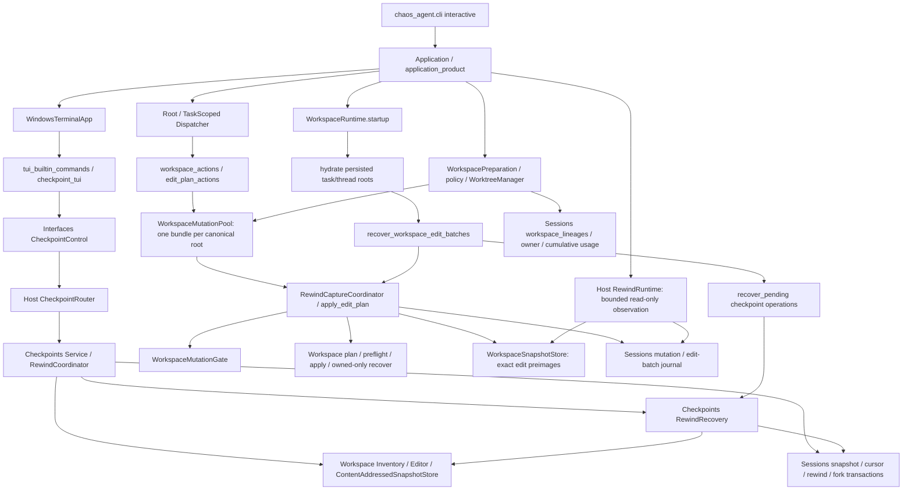

# S14 四类职责与保留裁决（只读调查）

当前结构的主要复杂度来自四种不同保证，不能把名称含 Rewind 的代码和表整体视作用户撤销成本。建议保留现有安全语义，停止新增恢复框架；仅把已证明无生产调用的展示/兼容适配列为后续精简候选。本报告没有改产品、契约、数据库、工作区或快照，也不放行 S14。

## 可复跑规模口径

运行 candidate 锁定 Python：`C:/Users/Windows11/.codex/worktrees/next-version-s2-baseline/chaos-16-agent/.venv/Scripts/python.exe docs/next-version/s14/inventory.py`。脚本只读取源文件，使用 AST/tokenize，不 import 产品，不构造 SessionDatabase；只写本目录 `inventory.json`。

每个选中文件、表仅有一个主归属；共享依赖另列。JSON 包含路径、原字节 SHA-256、逐文件物理/有效行、AST 测试方法与所选模块之间直接 import 边。有效行为携带 Python 语法 token 的物理行，去掉空行、注释和仅 docstring 行；不是语句数、分支数或复杂度。AST 方法数不等于 unittest discovery 或执行数。表从生产代码中的 CREATE TABLE 常量提取去重，不读取真实数据库。

| 唯一主归属 | 源文件 | 源物理行 | 源有效行 | 测试文件 | 测试物理行 | AST test 方法 | 专属主归属表 |
|---|---:|---:|---:|---:|---:|---:|---:|
| 用户撤销 user_undo | 36 | 6,834 | 5,857 | 50 | 10,233 | 407 | 3 |
| 编辑并发/文件身份 edit_identity | 60 | 9,480 | 8,156 | 38 | 7,071 | 259 | 5 |
| 崩溃恢复 crash_recovery | 16 | 2,660 | 2,295 | 17 | 2,628 | 66 | 3 |
| 工作区隔离/归属 workspace_ownership | 29 | 4,101 | 3,311 | 21 | 3,847 | 176 | 2 |
| 合计（不重复） | 141 | 23,075 | 19,619 | 126 | 23,779 | 908 | 13 |

这是明确扩展至安全 I/O、Git/worktree、类型化编辑恢复等依赖的系统职责范围，包含兼容模块和跨职责函数的整文件体积，不是 Rewind 独占、可删或首次启动实际加载量。`app.py`、`cli.py`、`action_dispatcher.py`、`application_product.py`、`foreground_tasks.py` 及 Sessions 通用 schema/core 容器列在 shared_not_counted，不把全部行强摊给某类。普通 messages/tasks/checkpoints/budget/verification 表属共享事实，不在 13 表合计中重复加入。S1 的名称过滤 20,238 物理行、当时临时库 41 表有不同范围，不能用这两次数值推断代码/数据库增长。

13 表分配：

- 用户撤销：workspace_snapshots、workspace_snapshot_entries、checkpoint_workspace_state。
- 编辑身份：workspace_rewind_coverage、workspace_mutations、workspace_mutation_paths、checkpoint_rewind_facts、checkpoint_rewind_expectations。
- 崩溃恢复：rewind_operations、workspace_edit_batches、workspace_edit_batch_operations。
- 工作区归属：workspace_lineages、workspace_lineage_usage。

## 实际职责

用户撤销：Checkpoints Service/Coordinator/Recovery 与 Interfaces CheckpointControl 提供 code/session/code_and_session 三模式；捕获的是 lineage 完整工作区 inventory 与内容寻址 blob，持久发布 cursor。用户明确确认后，先创建完整可物化 pre-rewind checkpoint，再写 Saga intent；会话模式非破坏性分叉，replacement 接 owner，原 Task superseded。预览/恢复最多 100 路径、16 KiB，不重放命令，不回退累计预算。Host `workspace_checkpoint_runtime.py` 只接线 Workspace 与 Sessions，UI 不直接恢复文件。

编辑并发/身份：WorkspaceEditor 的 plan/preflight/CAS 与 Host WorkspaceMutationGate、CoordinatedSessionRepository、RewindCaptureCoordinator 将批准动作、精确 bytes/existence 前镜像、mutation 高水位和 checkpoint 排序绑定于 canonical root。单文件 typed 写、批准 batch 与未知副作用 gap 各有真实事实。PRE/POST 内容匹配不能代替 POST 文件身份；同 bytes 的外来新文件仍必须保留。路径 containment、敏感/ignored 文件、reparse/链接和原生精确 move/delete 属编辑安全，不能因关闭用户撤销就删除。

崩溃恢复：typed edit journal 与 checkpoint Saga 是两种恢复任务。批次有 prepared/applying/rolling_back/completed/rolled_back/conflicted；初始任何 FOREIGN 必须零写，之后仅逆序恢复已证明 owned POST，并逐步复核。checkpoint Saga 从权威 operation ID 重读，在 quiesce→lineage lock 顺序下恢复 rollback checkpoint，invalidation 成功后才记 rolled_back，否则 recovery_required 并闸住 lineage。两者都不能 forward resume 或重放未知动作。

工作区归属：Host direct/managed 选择、Services/MutationPool/SessionRouter 逐 root 复用对象；source/task 不共享 gate、plans 或 snapshots。Git WorktreeManager 用仓库 common-dir 身份、task branch 与有界 repository lock 约束创建/补偿/删除。direct 不为普通任务自动创建/复制 worktree；非 Git 路径由已有 typed edit 前镜像保护而非伪造 Git checkpoint。旧 artifact roots 是验证后 missing-only 只读 fallback，不迁移、不写回、不 GC。

## 生产依赖图

`/rewind` 的当前生产执行路径是 `tui_builtin_commands.py:54 → begin_rewind → CheckpointControl → CheckpointRouter`；`tui_rewind_commands.handle_rewind_command` 是独立的只读 list/preview 适配，不等于当前执行器。`RewindRuntime` 明确没有 apply/restore/approval/provider API，双观察获取稳定事实；不能因为都有 preview 字样就合并其写边界。CLI argparse 当前没有独立 destructive rewind 子命令；图中 CLI 指它装配的交互入口，不宣称 JSON/ACP/远程手机具备同一 Rewind execute UI。

启动顺序实际是 `workspace_runtime.py:111-121` 的 hydrate→batch recovery→checkpoint pending recovery→hydrate→reclamation；批次 conflict 阻后续 roots/checkpoint recovery，不能颠倒为先用户 Saga 恢复再批次。所有根的绑定经 persisted lineage 事实，recovery probe 仅负向快路；正向仍取 gate 并重读。

主要定位证据：`workspace_checkpoint_runtime.py:38/81/85`；`app.py:162`；`rewind_sessions.py:73/110`；`rewind_edit_batch.py:34/102/158`；Workspace `_batch_recovery.py:29`；Sessions `_edit_batch_schema.py:88` 的 v22 identity migration；Checkpoints `_rewind_recovery.py:94`；Interfaces `checkpoint_tui.py:125/158`。跨类 import 边和逐文件 SHA 见 inventory.json。

## 旧 P1 裁决与当前验证边界

S1 `issues.md:19` 的 REWIND-01 和 `baseline.md:48-52` 已记录：身份/取消修复不是未实现，3 项集成 + 12 项身份恢复选测通过，但完整强杀和 generation 矩阵待 S14。本次静态核验继续支持“已实现”，不以旧日志或 S13 全套通过宣称全部故障窗口关闭。

| 保证 | 当前实现/已有针对性测试 | 本次裁决 |
|---|---|---|
| 同内容不同身份不覆盖 | journal v22 target_post_device/inode；batch recovery 的 update/create/move replacement、missing_post_identity_never_writes；Windows replace identity test | 必须保留；已找到实现和既有反例测试，不重新标为未实现 |
| 取消不丢恢复结果/证据失效 | Host apply_edit_plan 在持久 POST 证明后才 honor cancellation；取消返回 recovered status；test_rewind_batch_recovery_cancellation、test_rewind_batch_commit_linearization | 必须保留；需 S14 实际故障运行结果再关闭整条矩阵 |
| case-only rename 恢复原文件拼写 | case_only snapshot 仅 source 前镜像；test_rewind_case_only_crash_recovery | 必须保留；代码/测试已存在 |
| foreign conflict 零写且阻后写 | Workspace recover_batch 初次全量分类；mid-recovery drift 保外部修改；startup foreign_batch_blocks_later_roots_and_checkpoint_recovery | 必须保留；不能删除 journal gate |
| rewind completion/invalidation/owner 原子性 | Checkpoints invalidation failure、combined fork rollback、session owner transfer；Sessions session rewind atomic/integrity tests | 必须保留；不能用一般 shell exit0 替代 |
| 源/任务/子动作唯一归属 | MutationPool、SessionRouter、task scoped / child lineage integration tests | 必须保留；不能合并根 gate |
| 旧记录/schema 可读 | v18→v19 批次迁移，v22 nullable paired POST 证明，legacy terminal、rewind/cursor migrations | 必须保留；不能删除旧列、表或只读 fallback |

特别是进程在文件替换之后、POST 身份落库之前强杀时：没有 durable proof 的 POST 不能安全自动回滚，现有保守行为必须是 FOREIGN/冲突留存而非按 bytes 猜归属。主阶段的故障测量应明确记录这个窗口的受阻与文件保留结果，而非要求每种窗口都自动恢复。

## 保留/简化候选及停止扩张

保留两种 snapshot store：内容寻址 checkpoint blob 面向完整 lineage 撤销/去重；WorkspaceSnapshotStore 面向逐批准动作的精确前镜像与工作区身份绑定。合并需要格式迁移、旧句柄读取和恢复对账，当前没有安全收益证据，不建议在 S14 实施。

保留两种锁：mutation gate 约束同工作区 typed 编辑/checkpoint 排序，lineage lock 约束 Saga 同 lineage 撤销与恢复；跨进程 repository lock 保护 Git worktree lifecycle。其作用域和持久事实不同，不能去重成一个全局锁。

可审查候选仅为只读展示适配/转发重复：`tui_rewind_commands` 与当前 checkpoint modal 的名称冲突、Host 只读 projection 和 Interfaces render 的重复字段，及部分 Sessions codec/row validation 近邻。先核 registry/外部导入和旧测试承诺，能删除的只是确定未使用适配或重复纯函数，不能删除只读观察、身份验证或持久字段。本次尚未证明某一文件无合法调用，建议不做代码删减，而把每类主归属和容量限制记录清楚。

禁止新增第三个恢复 loop、第二套 owner/租约、自动 GC 旧根、覆盖式 schema 简化、全局缓存 recovery negative 结果。保留脏/未跟踪文件、非 Git、ignored/敏感边界、外部变化、稳定文件身份、可取消收尾、旧记录和累计预算。不能把任意 shell/外部服务效果纳入自动撤销保证。

本次执行物证：inventory.py 实际 exit0 写出 JSON；所有逐路径 SHA 可重新读取核验。没有运行故障测试或性能 benchmark；运行日志与主阶段 matrix/measurements 应另外裁决。
