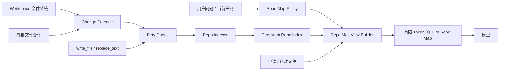

# 增量式 Repo Map 与渐进式任务视图设计

## 1. 背景

当前 Repo Map 在模型回合的同步关键路径上扫描工作区、解析源码并生成仓库摘要。对于大型目录，尤其是用户主目录或磁盘根目录，这会产生明显的首次响应延迟；工具调用产生多个模型回合时，相同扫描还可能被重复执行。

本设计将 Repo Map 拆分为两个概念：

- **Repo Index**：持久维护的仓库事实索引，记录文件、符号和依赖，只针对变化文件增量更新。
- **Turn Repo Map**：针对当前任务，从 Repo Index 中查询、排序并裁剪得到的轻量上下文视图。

核心原则：

> 昂贵工作只针对变化文件执行；每个模型回合只进行便宜的查询、排序和 Token 裁剪。

## 2. 目标与非目标

### 2.1 目标

- 普通问候和非代码问题不扫描工作区、不生成 Repo Map。
- 工作区文件清单不在每个模型回合重新构建。
- 文件新增、修改或删除后，只更新受影响的索引记录。
- Repo Map 采用渐进式披露，并具有明确的 Token 上限。
- Repo Map 只作为代码导航信息，不代替真实文件读取和验证。
- 索引更新不能阻塞 TUI 输入和普通模型请求。
- 状态栏能够区分工作区扫描、上下文构建和模型请求。

### 2.2 非目标

- 第一版不引入向量数据库或 Embedding。
- 第一版不构建完整语义知识图谱。
- Repo Map 不自动生成架构结论或自然语言设计说明。
- Repo Map 不替代 `AGENTS.md` 中的设计意图、边界和协作契约。
- Repo Map 不能作为任务完成或验证证据。

## 3. 总体架构



主要组件：

1. `WorkspaceSnapshot`：保存工作区文件及其签名。
2. `ChangeDetector`：识别新增、修改和删除文件。
3. `RepoIndexer`：只解析脏文件并更新索引。
4. `RepoIndexService`：管理持久索引、版本和并发读取。
5. `RepoMapPolicy`：决定是否生成 Repo Map、披露层级和 Token 预算。
6. `RepoMapViewBuilder`：从索引生成本轮轻量视图。

## 4. 工作区识别

### 4.1 工作区类型

```python
class WorkspaceKind(Enum):
    PROJECT = "project"
    SMALL_FOLDER = "small_folder"
    GENERAL_DIRECTORY = "general_directory"
```

建议识别规则：

| 类型 | 识别信号 | 默认行为 |
|---|---|---|
| `PROJECT` | 存在 `.git`、`pyproject.toml`、`package.json` 等项目标记 | 后台建立或更新索引 |
| `SMALL_FOLDER` | 无项目标记且文件数低于阈值 | 建立轻量索引 |
| `GENERAL_DIRECTORY` | Home、磁盘根目录或大型普通目录 | 默认不建立 Repo Index，按需搜索 |

在 `GENERAL_DIRECTORY` 中，问候或通用问题应直接请求模型。只有明确的文件任务才允许针对指定路径执行有界搜索。

### 4.2 文件发现

Git 项目优先使用：

```powershell
git ls-files --cached --others --exclude-standard
```

非 Git 项目优先使用：

```powershell
rg --files --hidden
```

默认忽略：

```text
.git
.chaos-agent
.code-agent
.codex
.cache
AppData
node_modules
.venv
venv
__pycache__
dist
build
coverage
```

项目 `.gitignore` 应继续生效，并允许增加 Chaos Agent 专用的忽略配置。

## 5. 持久 Repo Index

### 5.1 存储位置

推荐将索引保存在用户数据目录，避免污染仓库：

```text
%LOCALAPPDATA%/chaos-agent/indexes/<workspace_hash>/repo-index.sqlite3
```

`workspace_hash` 由规范化后的工作区绝对路径计算，不包含用户密钥或文件内容。

### 5.2 数据模型

```sql
CREATE TABLE workspace_files (
    path            TEXT PRIMARY KEY,
    size_bytes      INTEGER NOT NULL,
    modified_ns     INTEGER NOT NULL,
    content_hash    TEXT,
    language        TEXT,
    parse_status    TEXT NOT NULL,
    indexed_at      INTEGER NOT NULL
);

CREATE TABLE symbols (
    path            TEXT NOT NULL,
    symbol          TEXT NOT NULL,
    kind            TEXT NOT NULL,
    line            INTEGER NOT NULL,
    signature       TEXT,
    PRIMARY KEY (path, symbol, line)
);

CREATE TABLE dependencies (
    source_path     TEXT NOT NULL,
    target_path     TEXT NOT NULL,
    kind            TEXT NOT NULL,
    PRIMARY KEY (source_path, target_path, kind)
);

CREATE TABLE index_metadata (
    key             TEXT PRIMARY KEY,
    value           TEXT NOT NULL
);
```

`index_metadata` 至少记录：

- schema version；
- workspace path hash；
- index generation；
- 最近完整文件清单检查时间；
-索引器版本。

SQLite 建议配置：

```sql
PRAGMA journal_mode=WAL;
PRAGMA synchronous=NORMAL;
```

## 6. 初始化与后台更新

TUI 启动时：

```text
1. 识别 workspace 类型
2. 加载已有 SQLite 索引
3. 发布最后一个完整 IndexSnapshot
4. 立即允许用户输入
5. 后台检测文件变化
6. 增量构建下一代索引
7. 事务提交后原子切换 generation
```

禁止在 TUI 启动或首次普通对话时同步等待完整索引。

模型请求可以使用稍旧但内部一致的 `IndexSnapshot`；不得读取更新到一半的索引状态。

## 7. 变化检测

### 7.1 文件签名

第一版使用文件大小和修改时间：

```python
@dataclass(frozen=True)
class FileSignature:
    size_bytes: int
    modified_ns: int
```

变化结果：

```python
@dataclass(frozen=True)
class WorkspaceDelta:
    added: tuple[str, ...]
    modified: tuple[str, ...]
    deleted: tuple[str, ...]
```

### 7.2 触发时机

- TUI 启动后后台检查一次。
- 用户提交任务时，如果距离上次检查超过 10–30 秒，则启动低优先级检查。
- `write_file`、`replace_text` 成功后直接将目标路径加入 Dirty Queue。
- 可能修改文件的命令执行后，在回合结束时安排一次有界检查。
- 外部文件变化第一版采用低频快照；后续再评估文件监控器。

第一版不依赖 Windows 文件监控事件，避免事件重复、丢失和资源生命周期问题。

## 8. 增量索引

`RepoIndexer` 只处理 `WorkspaceDelta`：

```python
class RepoIndexer:
    def apply_delta(self, delta: WorkspaceDelta) -> IndexUpdate:
        ...
```

处理流程：

```text
added / modified
→ 读取单个文件
→ 判断语言
→ 提取符号和 import / dependency
→ 事务替换该文件的索引记录

deleted
→ 删除文件、符号和依赖记录
```

单文件更新必须原子执行：

```sql
BEGIN;
DELETE FROM symbols WHERE path = ?;
DELETE FROM dependencies WHERE source_path = ?;
INSERT OR REPLACE INTO workspace_files (...);
INSERT INTO symbols (...);
INSERT INTO dependencies (...);
COMMIT;
```

解析失败时：

- 保留文件基本信息；
- 删除可能过期的符号和依赖；
- 设置 `parse_status = failed`；
- 记录有界诊断；
- 不阻塞模型请求。

## 9. Turn Repo Map

每个模型回合不再扫描文件系统，而是查询稳定快照：

```python
RepoMapViewBuilder.build(
    snapshot=index_snapshot,
    query=user_input,
    touched_paths=touched_paths,
    level=disclosure_level,
    token_budget=token_budget,
)
```

### 9.1 相关性评分

第一版采用确定性评分：

| 信号 | 建议分值 |
|---|---:|
| 精确路径命中 | +100 |
| 本轮已读或已改文件 | +80 |
| 精确符号命中 | +60 |
| 路径包含查询词 | +30 |
| 符号包含查询词 | +25 |
| 直接依赖 | +20 |
| 对应测试文件 | +15 |
| 最近修改文件 | +10 |
| `AGENTS.md` 声明的主要 Unit | +10 |

`AGENTS.md` 只作为主要 Unit 名称的加权信号；其自然语言内容不复制到 Repo Map。

### 9.2 输出格式

```text
Repository view [level=2, query="修复 token 刷新"]:

src/auth/service.py
  class AuthService:12
  method refresh_token:61
  deps: src/auth/token_store.py, src/providers/oauth.py

src/auth/token_store.py
  class TokenStore:9
  method load:35
  method save:48

tests/auth/test_service.py
  test_refresh_expired_token:72
```

Repo Map 只包含路径、主要符号、行号、依赖和相关测试。模型需要实现正文时调用 `read_file`。

## 10. 渐进式披露

```python
class RepoMapLevel(IntEnum):
    NONE = 0
    SKELETON = 1
    RELEVANT = 2
    EXPANDED = 3
    ARCHITECTURE = 4
```

| 层级 | 内容 | Token 上限建议 |
|---|---|---:|
| L0 | 不提供 Repo Map | 0 |
| L1 | 顶层目录、入口和 Feature | 500 |
| L2 | 相关文件、符号和直接依赖 | 1,500 |
| L3 | 间接依赖、测试和配置 | 4,000 |
| L4 | 跨模块架构视图 | 8,000 |

初始策略：

```python
def initial_repo_map_level(task: str) -> RepoMapLevel:
    if is_greeting_or_general_question(task):
        return RepoMapLevel.NONE
    if mentions_explicit_file(task):
        return RepoMapLevel.RELEVANT
    if is_architecture_or_large_refactor(task):
        return RepoMapLevel.EXPANDED
    return RepoMapLevel.SKELETON
```

第一版使用简单、可测试的规则，不额外调用模型分类。

### 10.1 主动扩展

提供只读工具：

```text
expand_repo_map(
    query: string,
    paths?: string[],
    symbols?: string[],
    level?: 2 | 3 | 4
)
```

扩展必须围绕具体查询、路径或符号。禁止无目标地展开整个仓库。

## 11. Turn View 缓存

```python
@dataclass(frozen=True)
class RepoViewKey:
    index_generation: int
    normalized_query: str
    touched_paths: tuple[str, ...]
    disclosure_level: int
    token_budget: int
```

缓存命中条件：

- Index generation 未变化；
- 查询和披露层级相同；
-相关路径集合相同；
- Token 预算相同。

文件变化提交后：

```text
更新 Repo Index
→ index_generation + 1
→ 旧 Turn View因 generation 不匹配自然失效
```

缓存使用进程内 LRU，保留最近 32–64 个任务视图即可。

## 12. Agent 回合集成

目标流程：

```text
Session 启动
→ 加载规则
→ 加载持久索引
→ 后台增量更新

每个模型回合
→ 获取稳定 IndexSnapshot
→ RepoMapPolicy 选择披露层级
→ 查询或命中 Turn View
→ 构建上下文
→ 调用模型
```

工具反馈：

```text
read_file
→ 将路径加入 touched_paths
→ 下轮提高相关性权重

write_file / replace_text
→ 将目标路径加入 Dirty Queue
→ 优先增量更新该文件
→ 提交新 generation

run_command
→ 若命令可能修改文件
→ 回合结束后安排低频 delta 检查
```

## 13. 并发与一致性

一致性模型：

```text
前台请求读取 generation N
后台任务构建 generation N+1
事务提交完成
原子发布 generation N+1
```

约束：

- 前台始终读取完整快照；
- 索引更新不阻塞问候和普通模型请求；
- Repo Map可能稍旧，但不得内部不一致；
- 修改代码前仍必须读取真实文件；
-验证和完成判断不得依赖 Repo Map。

## 14. 状态与可观测性

状态栏应区分：

```text
Index · ready · 1,284 files
Index · updating 3 changed files
Context · selecting relevant code
Model · waiting for response
Tool · reading src/auth/service.py
```

`/status` 建议显示：

```text
repo index: ready
generation: 18
files: 1,284
symbols: 9,420
last update: 3s ago
turn view: L2 · 1,126 tokens · cache hit
```

建议记录以下指标：

- 文件清单耗时；
-增量检查耗时；
-脏文件数量；
-单文件解析耗时；
- Turn View 构建耗时；
- Turn View Token 数；
-文件解析缓存和 Turn View 缓存命中率；
-索引 generation。

## 15. 公开接口建议

```python
class RepoIndexService:
    async def start(self) -> IndexSnapshot:
        ...

    async def refresh(
        self,
        paths: Sequence[str] = (),
    ) -> IndexSnapshot:
        ...

    def snapshot(self) -> IndexSnapshot:
        ...


class RepoMapViewBuilder:
    def build(
        self,
        snapshot: IndexSnapshot,
        query: str,
        touched_paths: Sequence[str],
        level: RepoMapLevel,
        token_budget: int,
    ) -> RepoMapView:
        ...


class RepoMapPolicy:
    def initial_level(self, task: str) -> RepoMapLevel:
        ...

    def token_budget(self, level: RepoMapLevel) -> int:
        ...
```

职责边界：

- `RepoIndexService`：仓库事实、持久化和增量更新。
- `RepoMapViewBuilder`：相关性查询、排序和 Token 裁剪。
- `RepoMapPolicy`：是否披露、披露层级和预算。

这些职责不应重新合并进一个 `RepoMapBuilder`。

## 16. 实施阶段

### 阶段 1：移除同步重复扫描

- 文件清单在 Session 内复用。
- 每轮不再执行完整 `_scan()`。
- Home 和磁盘根目录进入无项目模式。
-状态栏展示真实的扫描和上下文阶段。

### 阶段 2：增量更新

- 增加 `WorkspaceDelta` 和 Dirty Queue。
- Agent写文件后局部失效。
- 根据文件签名重新解析变化文件。
- 引入 `index_generation`。

### 阶段 3：持久化

- 使用 SQLite 保存文件、符号和依赖。
-重启后直接加载已有索引。
-后台核对外部变化。

### 阶段 4：渐进式视图

- 实现 L0–L4。
-增加相关性排名和 Token 裁剪。
-增加 `expand_repo_map`。
-增加 Turn View LRU 缓存。

## 17. 验收标准

- 在用户 Home 目录输入“你好”，不会遍历整个 Home。
- 无代码关联的请求生成 0 Token Repo Map。
-同一未变化项目的连续请求不重新解析源文件。
-修改一个文件后，只重新解析该文件及必要的派生关系。
-索引后台更新期间，模型仍可使用上一个完整 generation。
- L1–L4 输出不超过各自 Token 上限。
- `AGENTS.md` 与 Repo Map不重复保存自然语言架构说明。
- Repo Map中的路径和符号只能用于导航；修改和验证前必须读取真实文件。
-状态栏能够区分索引、上下文、模型和工具阶段。

## 18. 结论

推荐采用以下组合：

```text
按需搜索
+
本地持久 Repo Index
+
文件级增量更新
+
渐进式 Turn Repo Map
```

Repo Index解决重复扫描和重复解析，Turn Repo Map解决模型上下文过重的问题。两者必须保持独立：前者维护仓库事实，后者服务当前任务。
