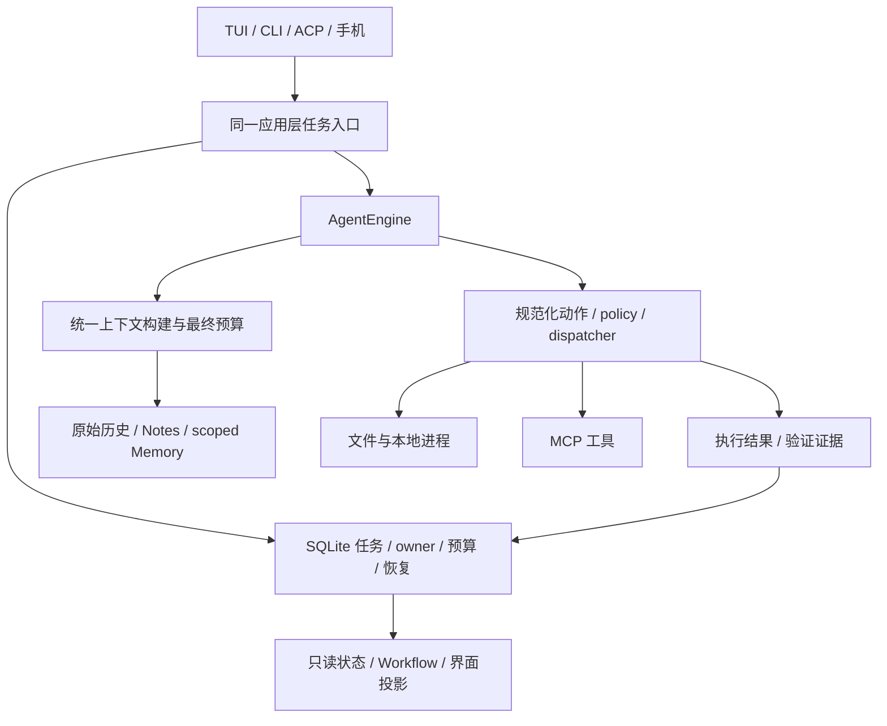

# chaos-agent 下一版本审视与迭代路线

日期：2026-10-04。基线：`main`，HEAD `5793c72f4b0509d488fa9434e2f43e6ba838fbcd`，按当前工作区源码审计。性质：分析与规划，未实施本报告中的产品修改。

## 核心判断

下一版本应围绕“同一个任务能正确执行、可靠停止、恢复后继续，并清楚交付结果”做收敛。现有项目已经具备大部分必要积木；主要瓶颈是默认路径未接通、不同入口组合不一致，以及功能完成与真实使用效果之间缺少可靠验收。

不建议推倒重写，不建议先增加 Agent 角色、Memory 框架、插件市场或更多模型协议。建议先修复已复现的执行与恢复问题，再用一个应用层执行入口统一 TUI、CLI、ACP、手机端和子任务，随后补全项目记忆与长期上下文的最小闭环。删除应针对已被替代的实现和不必要的产品选择，而不是删除有恢复价值的底层事实。

衡量迭代只问五件事：

1. 用户的任务是否真的完成，结果是否可核验？
2. 失败、暂停和断线后，能否接着做而不重复不确定副作用？
3. 相同任务从不同入口执行，权限、工作区、预算和终态是否一致？
4. 用户是否少配置、少解释、少手动救场？
5. 时间、token 和维护负担是否有实际下降？

## 审计范围与证据层次

通读根规范，调查生产入口、核心循环、任务状态/持久化、恢复与工作区、上下文、Memory、Tools、MCP、Skills、Plugins、Provider/认证、CLI/TUI/ACP/手机入口和评测。三份专题记录提供具体代码位置：

- [执行与恢复审计](next-version-runtime-audit-20261004.md)
- [能力与上下文审计](next-version-capabilities-audit-20261004.md)
- [入口与体验审计](next-version-experience-audit-20261004.md)

本轮的“复现”指离线合成输入、临时数据库或 fake provider/adapter 下的实际结果；“源码确认”指追到生产调用链；“建议”是尚未实施的设计判断。没有调用真实付费模型、连接外部 MCP、操作用户真实会话库或进行新一轮手机/终端端到端操作。查看了已有手机聊天截图，但它只能证明当时的展示，不能证明本次真实使用顺畅。

保留工作区原有 authentication 三个文件的修改及原有未跟踪目录/产物；本轮只新增审计文档、只读诊断脚本与结果。历史报告用于找线索，当前判断以重新核对的代码为准。

静态盘点基于 Git 跟踪的 Python 文件，排除测试和 scripts 后为 **632 文件、89,506 物理行**；测试为 **509 文件、74,155 行**。其中应用组合层 `chaos_agent` 为 120 文件/17,388 行，`interfaces` 为 125 文件/15,309 行。行数包含空行，不能直接判定过度设计；它说明未来重构应重点审查入口组合与状态投影，而非继续把每个函数拆成新模块。数据与可复跑脚本在 `artifacts/next-version-audit-20261004-inventory.*`。

静态导入图发现 `context/context_windows/sessions/thread_intelligence/verification/runtime/policy` 的相互依赖组，以及 `plugins/orchestration`、`core/capabilities` 相互依赖。统计包含类型检查与延迟导入，不能当成运行时循环导入故障。正面事实是没有发现 Feature 反向导入 `chaos_agent` 组合层。

## 一、当前最主要的问题

### 1. 恢复门、执行所有权和结束状态尚未形成一致契约

| 问题 | 当前证据 | 对用户的影响 |
|---|---|---|
| 未知工具结果可被第二次继续绕过 | `interfaces/task_controller.py:98` 只在 PAUSED/INTERRUPTED 检查 unknown；第一次变 WAITING_DECISION 后，第二次恢复直接进入 RUNNING。临时库与 ProbeRunner 已复现 | 用户以为恢复已经处理过未完成动作，实际上系统尚未知道上次动作是否执行 |
| 执行 owner 注册可覆盖，RUNNING 无 owner 的窗口无法被扫描到 | `sessions/_task_execution.py:32` upsert 无排他声明；`:43` 使用内连接。离线分别复现覆写和漏对账 | 多入口/多进程和启动崩溃时，任务状态与真实执行者可能分离；不把它扩大为已经发生双写的结论 |
| CLI 失败/取消/等待仍可能 exit 0 | `interfaces/commands.py:101-137` 消费事件后直接返回 0；8 种离线事件组合均复现 | 脚本和调用者难以判断任务是否成功 |
| 子 Agent 的流结束被当成成功 | `chaos_agent/child_runner.py:85-125` 不处理 ERROR/CANCELLED 终态，流正常结束统一 COMPLETED；仅 CANCELLED 的 fake 流已复现 | 父任务可能收到错误的完成信号 |
| 子任务租约与生产 Engine 限制没有接成一个预算 | `runtime_dispatcher_factory.py:48-70` 只接 AgentDefinition，未接 ChildRunRequest；`application_context.py:291-318` 用 profile/mode 构建限制 | 请求级预算更多停留在预留/事后核算；进程内父预算释放后也不等于跨恢复累计预算 |

这些不是要求再加一个巨大状态机。已有 Task、SQLite、owner、预算和恢复记录已经足够；应修正事务边界、合法迁移与事件结果映射。未知结果必须经过明确核验/处置才能解除等待，反复点继续不能成为隐式处置。只读查询可按条件重试；已发出的写操作应先核验结果，不能统一自动重放。

### 2. 新工具外观与旧执行语义出现错位

compact tools 已将模型常用入口收敛为 `read/search/write/edit/execute`，底层仍执行 typed actions，这是合理方向。但 `core/_engine_convergence.py:42-45` 将外部工具名交给 `ToolOnlyConvergenceGuard`，`core/exploration_repeat.py:115-121` 的进展集合只认识 `write_file/replace_text/...`。

主审计独立复现：连续五轮无文字的 `write`、`edit` 请求依次触发 warn/finalize；同样五轮 `write_file`、`replace_text` 不触发。它证明同一类工作因入口别名而得到不同收敛判断，不等于每次真实写入任务都会提前停止。

更好的修复是让收敛、预算、错误归类、验证失效都消费同一份规范化动作结果与实际进展，而不是在每个守卫里不断补工具名。保留目前防重复和反思提示，但不要再堆“几轮没文字就停”的新规则作为智能升级。

### 3. “存在模块”不等于“默认产品已经具备能力”

**Memory。** 作用域、来源、修订和撤回模型已实现；生产 `RuntimeContextFactory` 没有传 `memory_project_id`，也没找到面向用户的项目记忆维护入口。跨任务记忆还不是默认闭环。已有任务 History/Notes 不应被误称为已完成的长期项目记忆。

**结构化验证。** `chaos_agent/verification_mode.py:6-8` 明确默认关闭，正常路径隐藏/拒绝 `run_verification`，Engine 不依赖这套 ledger gate。普通 shell 测试仍然可运行。这是显式产品选择，不能仅因存在 verifier 代码就称默认任务已完成严格验证，也不应简单全局打开，重新造成问答/小修改被不相关测试阻挡。

建议把“已回答/已执行”“有验证结果”“用户接受部分结果”区分清楚；按任务类型采用最低充分验证：分析关注来源和答案，小改动执行相称检查，有行为变化才要求相关测试。把实际运行的验证证据接回统一任务结果，而不是以模型说完成作为证据，也不是强制每个任务跑全仓测试。

**ACP。** 生产 adapter 注入 `application.controller`，调用 `ask()` 而不经过前台持久任务路径（`chaos_agent/acp_adapter.py:17-23`、`code_agent/acp/adapter.py:189`）。`list_sessions` 全局列 thread 却统一标注当前 cwd；`load_session` 校验传入 cwd，没有校验该 thread 的持久工作区归属（`:104-145`）。源码确认，未连接真实编辑器复现。应先收敛任务/工作区归属，再谈丰富编辑器功能。

### 4. 长上下文具备机制，但覆盖、成本和默认策略分散

- 无 context policy 的旧 semantic pipeline 与 `summary/boundary/persistent` 并存；它们承载不同实验与兼容语义，不能未经比较直接删掉。
- `search_threads` 依赖 semantic checkpoint 索引，新消息不一定可搜；persistent `history_*` 读取另一套原始历史。新建并写入一条消息后 semantic search 仍返回 0，已离线复现。
- 每轮上下文构建、单条 history 读取仍可能先全量加载 thread records；返回分页没有解决底层全量 I/O 与解码成本。尚未测大库实际延迟，不报虚构性能损失。
- 项目记忆查询先按时间 `LIMIT` 再匹配；5 条记忆中第 5 条唯一相关，limit=4 得 0、limit=5 得 1，已复现。
- 旧上下文路线在预算分配后追加 Skill 全文，没有与 managed 路径相同的最终完整请求容量门。

优先升级一套可按 sequence/stable ID 有界读取的历史服务和一次最终请求预算计算，随后用真实续接任务选默认策略。没有证据支持此时引入第二个向量数据库或自动记忆 Agent。

### 5. 维护复杂性主要来自重复组合与多份状态投影

生产 `app.py + application_*` 与 `app_factory.py + factory_*` 两套组合路径并存。旧路径在部分根集成测试中仍被导入；子 Agent 的旧 factory 能注入 parent lineage，而生产 `RuntimeDispatcherFactory.child_engine` 没有同样接入。这是“测试通过，但实际组合仍有缺口”的具体原因。

还应区分：Task 是执行事实，Thread 是对话记录，Workflow DAG 是展示投影，Terminal/Remote state 是界面投影。当前 `observe_task_created` 会在 Workflow/plugin observer 出错时中断创建的任务（`foreground_task_observers.py:16-43`）。这种显式 fail-closed 有其设计意图，但一个非执行投影不宜长期成为普通任务可运行的前置条件。

建议保留关系，减少第二份可写状态：Workflow 只做可重建投影，不扩成新调度器；展示失败不制造执行成功，也不默认阻断已合法的任务。只有真正参与权限/动作决定的扩展才能作为执行前置条件。不要新建巨型全局 Event Bus 来替代全部明确调用。

### 6. 体验已经改进，但“简单任务要先初始化整个应用”仍是负担

当前 TUI 已有中文默认、分层命令菜单、历史选择、暂停/续接、附件草稿和 compact 视口，不能按旧 README 断言界面仍展示所有 mode。问题更多在底层：`task list` 等只读管理命令仍先创建并启动完整 application，因此也依赖 Provider 配置、PowerShell 和部分扩展初始化；首次未配置时不能先进入 TUI 再靠 `/login` 完成初始化。

建议默认路径收敛为“打开项目 → 配一次模型/账号 → 描述任务 → 查看结果或继续”。高级 profile、模型推理深度、拓扑、隔离策略应按需出现；旧 low/medium/high/ultra 在恢复读取层保留，逐步退出普通配置推荐。底层精确状态要保留，UI 不必让用户理解所有内部枚举。

手机端已有明确用户场景，应保留。统一它和桌面端的项目/任务事实与断线恢复，不因界面数量而删除能力，也不同时继续扩张 PWA、SSH 包装、TUI 布局各自的业务逻辑。已有截图与旧验收不能替代当前手机端跨断线/审批/切项目验收。

### 7. 测试数量足够多，但缺“生产路径是否测到”和“真实任务是否好用”

标准 runner 是 unittest discovery。`sessions/tests/test_memory.py:11` 是依赖 `tmp_path` 的模块级测试函数，实际被发现 0 项，仍报告 OK。主审计手动调用函数通过，但这没有修复默认漏测。

`evaluation/benchmark.py:145-176` 将 replay observation 转成 ExperienceTaskRecord，未采集 interventions/retries 时用 `or 0`；报告标题又叫 Real-task experience。这会让“未观测”看似“零介入/零重试”。应保留 unknown，并写明 replay、离线 Host、真实 API、真实 UI 各自证据类型。

已有真实 SWE-bench 三题最终 patch 3/3 通过，是有价值的历史证据；原报告也明确存在预算停止、Provider 流失败和依赖问题，不能推广为正常收敛率或当前版本广泛能力。见 `docs/evaluation-baseline-plan.md:52`。本轮未重新运行这些付费/容器任务。

因此下一版不缺新的“评分体系”，缺一个复用现有 trace/runner 的固定任务验收入口与简洁汇总：任务成功、验证、错误完成、人工介入、无效重复、Provider 故障、耗时与真实 usage。把基础设施故障单列，同时保留用户实际遭遇的总失败率。

## 二、应保留的核心设计

| 核心设计 | 为什么保留 | 约束 |
|---|---|---|
| 与 UI 分离的单 AgentEngine、typed action、统一 policy | 是跨入口复用和权限一致性的基础 | 统一生产组合，协议实现不承担任务语义 |
| SQLite 保存 Task/Thread/messages/events | 本地优先、可查、可迁移，已有广泛实现 | 不另建平行状态数据库；修复 owner 事务与有界读取 |
| 原始历史不被摘要覆盖；来源锚点和完整工具组 | 是可追溯续接和纠错基础 | 摘要/Notes/Memory 都是参考，不能提升为权限或完成证据 |
| Workspace 事务、文件身份、CAS、checkpoint/rewind | 保护未提交内容、普通目录与失败恢复 | Git 管版本/隔离，CAS 管恢复字节；二者不是完全重复 |
| shared RepoIndex、FTS、静态关系图 | 避免多服务重复扫描 | 候选定位不能冒充根因或安全删除证明 |
| Skills 作为指令、MCP 作为工具连接、Plugins 声明式贡献 | 有清晰基础边界，可组合 | 保留一个实际执行与授权链，不开放旁路 |
| 进程树取消、硬预算、子 Agent 单写者约束 | 长任务可控的必要底座 | 核对所有生产入口及父子累计预算；本地执行器不宣称 OS 沙箱 |
| 独立 verifier/grader 与故障场景 | 能拒绝模型自述成功、发现恢复问题 | 必须测真实生产工厂，而非只测较完整的旧工厂 |

两个旧问题不应重复规划：`工作区的问题清单.md` 里的“崩溃文件身份缺失”和“取消+partial 不失效”已有后续实现处理，见运行审计源码索引。本轮只核对实现和部分 focused tests，没有重做完整真实 Windows 崩溃矩阵。应同步旧文档状态，不能把历史暂缓当成当前已证缺陷。

## 三、删除、简化与重构的具体范围

| 对象 | 建议 | 删除/迁移条件 |
|---|---|---|
| `app_factory.py/factory_host.py/factory_context.py` 等旧组合 | 优先合并到唯一生产 composition，再删被替代实现 | 先把旧路径特有的 lineage、构造清理等有效能力迁入；测试改测真实入口，检查外部导入兼容 |
| `subagent_runner.py` 中重复 Runner | 删除候选 | 当前无生产引用不等于绝对死代码；确认包 API 与插件依赖后删除 |
| `legacy/hybrid/progressive` 与四条上下文路线 | 收窄为一个推荐默认、有限实验开关、旧记录读取适配 | 固定任务 A/B 与历史会话恢复通过后退役旧生产写入路径 |
| 旧四档 mode、重叠环境别名、重复命令路径 | 新配置使用明确 model/profile/effort 与可选协作；减少普通界面选择 | 老 snapshot 解码保持；给明确弃用边界，不一次清掉全部别名 |
| Workflow DAG、Terminal/Remote state | 只读可重建投影，不再决定任务事实 | 保留用户确有价值的进度/父子关系展示，不扩 DAG 调度语言 |
| Plugins events/custom modes/custom agents | 冻结扩展面，按真实依赖逐项收缩 | 本轮没读用户私有插件，不能宣称无人用或直接删除 |
| semantic insights 的低频诊断视图 | 保留共享底座，暂停新增视图 | 有使用与收益证据才继续；不因静态零消费者自动删代码 |
| 自建 Web 的站点专用与浏览器能力 | 保留有界 HTTP/来源；复杂登录站点优先成熟连接器 | 当前 DDG HTML 正则/headless 新浏览器是薄实现；未做在线可用性验收 |
| 历史计划、过期问题单、根目录实验输出 | 把当前产品契约与历史实验明确分开，归档已替代说明 | 不清理用户未知来源目录；不将 `.agents` 与各工具配置复制目录算成生产模块 |

不用文件数或“每个 feature 不超十个 unit”强行驱动拆分。Sessions 可以继续共享一个数据库；内部按任务、历史、记忆提供窄接口，优先降低调用者对巨大 repository 的依赖，不为整齐再造仓储框架。

## 四、下一版值得新增或升级的能力

### 统一任务执行入口

在现有应用层收敛出共享 start/continue/cancel/result 服务，复用现有 TaskRecord、TaskContract、ActionExecutionContext 与 SQLite。主任务和子任务携带同样明确的任务/父任务、thread、workspace、owner、冻结 runtime 和预算关系。界面只翻译输入和投影输出。

图是目标边界，不是新建全部模块。先把一条真实任务贯通，再迁另一入口，不进行全仓目录搬家。

### 可解释的任务恢复

统一展示上次做到了哪里、哪些结果已确认、哪些动作结果未知、当前缺什么，以及唯一可执行的下一步。未知写操作支持针对具体 effect 的核验或用户处置；只读失败、调用未发出、结果未知、权限拒绝、参数错误采用不同恢复方式。恢复仍属于同一任务预算，不能靠重启刷新成本上限。

### 最小项目记忆闭环

可信 project identity 绑定 → 用户明确保存决策/约束 → 查看/修订/撤回 → 先检索后排序和截断 → 注入时显示来源与适用性。默认先做项目域，跨项目用户记忆保持显式选择。先证明旧但相关记录能召回、错误能改、撤回后不出现；随后再判断自动提炼与语义检索是否值得。

### 统一能力清单与扩展诊断

一个用户入口展示 Tools/Skills/MCP/Plugins 的来源、已安装、已启用、连接就绪、当前可调用、缺什么。内部继续分层：Tools 是执行契约，Skills 是任务方法，MCP 是连接，Plugins 是同源能力的包装。不能为了界面统一再造第四个执行器。

MCP 优先补完整启动/关闭 deadline、ready/failed 状态、可读诊断和结果未知处理，再根据明确服务器需求支持额外 transport。Plugins 若升级，优先打包现有 Skill/MCP/命令的安装体验，而非更多事件钩子和编排语法。

### 真实任务反馈与相称验证

把已有 action metrics、provider usage、task outcome 和 verifier 结果按同一 task 汇总并能恢复后查看。现有 `ActionMetricsCollector` 仅进程内聚合，不能直接作为跨重启任务报告。只记录判断改进所需字段，未采集留 unknown，避免新建大型遥测平台。

## 五、按优先级的迭代路线

每一批独立验收，可发布；不等所有重构完成才交付。真实任务样本从第一批开始固定，后续每批沿用，避免边改边挑更容易的例子。

| 顺序 | 交付重点 | 退出条件 | 暂不做 |
|---|---|---|---|
| **P0-A：把当前行为与测试讲清楚** | 修 unittest 漏测、CLI 退出码/终态、默认验证说明；归档过期问题单与 release 状态 | Memory 测试真的执行；失败/取消/等待可机器区分；默认能力表与源码一致 | 新评分框架、模型排名 |
| **P0-B：闭合恢复与动作语义** | unknown 恢复门、owner 原子声明/对账、compact action 进展归一、子任务错误/取消/预算/工作区归属 | 连续恢复不绕过 unknown；重复 owner 被拒或明确接管；无 owner 崩溃可恢复；新旧工具入口结果相同；子任务终态真实且不刷新父预算 | 更多 Agent 角色、自动重试一切 |
| **P1-A：收敛生产 Host** | 将 CLI/TUI/ACP/remote/child 逐项接到同一任务服务；迁走旧 factory 测试并删除替代代码 | 同任务跨入口具有相同 workspace、授权、runtime、终态；ACP 会话按所属项目列出；历史查询无 Provider 也可用 | 全仓重写、微服务、第二调度器 |
| **P1-B：可靠长任务与项目记忆** | 原始历史可增量搜索/按 ID 读取；最终 prompt 一次计数；选一个默认上下文路线；补 Memory MVP | 短会话可搜；多窗/重启不丢最新目标与工具组；旧相关记忆可召回和撤回；大历史成本被测量；默认策略用同模型同任务比较 | 向量库、自动提炼所有对话、默认无限运行 |
| **P2：减轻扩展和跨端使用负担** | 首次登录/选项目、统一能力状态、MCP 生命周期、手机断线/审批/续接验收 | 新用户不手写多份配置完成首个任务；实际扩展能诊断故障；桌面与手机看同一任务事实 | 插件市场、更多站点特例、更多低频语义图面板 |

持续验收分三层，复用当前工具：

1. **离线正确性**：现有完整回归加本轮复现的缺口；重要的是覆盖真实 production factory 与组合路径，而不是单纯加测试数量。
2. **固定真实任务**：复用现有 replay/continuity/真实 bugfix 基础，覆盖分析、单文件改动、跨文件改动、工具失败、换窗、重启恢复、委派、扩展和手机续接。同模型/profile/任务/初始状态重复比较，保留失败记录。
3. **可交付性**：当前版本 wheel 安装、数据库升级、Windows 主使用路径和已有 CI 平台矩阵；手机/编辑器单独标已验或未验。

恢复误执行、错误完成与越过工作区归属应是阻止发布的正确性问题；性能/智能改进以基线对照为准。预先定义可接受的任务成功率、介入次数与耗时变化，尚无基线时不承诺任意百分比提升。不因一个小规模 3/3 或一次全绿就宣布长期稳定。

最值得先做的版本范围是 **P0-A + P0-B**：它们既能立刻改善信任与体验，也能为后续删除旧工厂、统一入口提供可守住的行为基线。P1 的重构应服务于这些已证问题，不以“架构更先进”为目标。

## 本轮验证记录

本轮不是发布验收，也没有得到全仓全绿结论。实际结果如下：

| 检查 | 本轮结果 | 解释 |
|---|---|---|
| Git 跟踪源码 AST 盘点 | 完成；生产文件无解析错误 | 包含类型检查/延迟导入，不把依赖组当成运行时错误 |
| 第一次 full runner（每套件 300 秒） | 附件套件 1 failure、3 errors | guarded read 打开系统 TEMP 的 Windows11 祖先目录时 Win32 5；对照显示普通读取成功、仓库临时目录 guarded read 也成功，归为此沙箱环境路径限制 |
| 仅为测试进程改 TEMP/TMP 后的 full runner | 21 个完整套件运行 1,580 项，6 skipped，其余通过；Sessions 在 300 秒退出 124 | timeout 栈位于测试 setUp 的 SQLite 初始化/迁移，监管器确认进程清理；未继续到后续 Feature 与根集成套件，不宣称全量通过 |
| 超时所在 `test_rewind_mutations.py` 单独执行 | 10 项通过，8.751 秒 | 不支持“该测试必然死锁”的结论；也不能由此证明整个 Sessions 通过 |
| Runtime 专题 focused tests | 35 项通过 | 与 full runner 有重叠，不相加为独立测试总数 |
| 能力/上下文专题 focused tests | 64 项通过 | mock provider、临时数据；与 full runner 有重叠 |
| CLI 专题 focused tests | 15 项通过 | 另有失败终态返回 0 的八组合反例，不矛盾 |
| Memory 默认发现与手动调用 | unittest 发现 0 项；手动调用函数通过 | 测试覆盖入口缺口已确认，未修改测试框架 |
| 离线反例 | unknown 二次恢复、owner 覆盖/遗漏、child 终态、生产 child lineage、工具别名进展、Memory 漏召回、短历史索引缺失、MCP 部分启动超时均有记录 | 使用合成输入或真实 factory + fake dependencies；没有真实模型/副作用验收 |

当前 `scripts/run_tests.py` 与 CI 的套件上限是 600 秒，而 `AGENTS.python.md` 仍写 300 秒。本次显式采用 300 秒，保留超时原始结果，没有通过扩大上限把它包装成通过；套件规模、环境开销与迁移初始化成本仍需在后续基线工作中区分。没有因这次超时修改任何产品代码。真实 Provider、真实编辑器、手机、完整长任务性能、跨平台运行、wheel 安装与数据库升级不计作本轮已验收。

主审计原始产物：

- `artifacts/next-version-audit-20261004-inventory.py` / `.json`：Git 跟踪源码规模与静态导入。
- `artifacts/next-version-audit-20261004-checks.py` / `.json`：新旧写工具进展判断差异、Memory unittest 零发现、Memory 函数独立执行结果。
- `artifacts/next-version-audit-20261004-read-probe.py` / `.log`：系统临时目录与仓库临时目录的普通/guarded read 对照。
- `artifacts/next-version-audit-20261004-tests.log`：首次完整 runner 在附件套件受环境路径权限阻断。
- `artifacts/next-version-audit-20261004-tests-workspace-temp.log`：仅给该测试进程设置仓库内 TEMP/TMP 后的全量 runner 结果。
- `artifacts/next-version-audit-20261004-sessions-focused.log`：超时所在测试文件的单独诊断结果。
