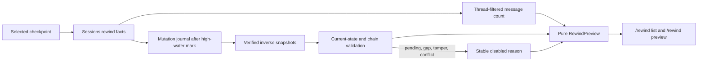

# Trustworthy Arbitrary-Checkpoint Rewind Design

**Status:** Approved design, implementation not started

**Date:** 2026-07-17

**Scope:** Task 7 of the CLI/TUI P0 recovery roadmap

**Decision:** Implement trustworthy previews for arbitrary covered checkpoints by
persisting per-action inverse snapshots and a mutation journal.

## 1. Purpose

The application needs a user-reachable rewind preview that can answer three
different questions:

1. What conversation messages are after a selected checkpoint?
2. What agent-attributable workspace changes would be undone?
3. Can both views be trusted at the same observed point in time?

The preview must be truthful when facts are missing, stale, damaged, or
incomplete. It must never infer rewind facts from current Git status,
`TaskState.files_changed`, caller-controlled checkpoint metadata, or global
SQLite sequence subtraction.

This delivery remains preview-only. It does not restore files, delete messages,
rewrite Git state, or expose an apply operation.

## 2. User-Visible Meaning

### 2.1 Conversation rewind

Conversation rewind describes messages belonging to the selected thread whose
persisted sequence is after the checkpoint's trusted message bound.

It does not mutate the thread in this delivery.

### 2.2 Code rewind

Code rewind means:

> Undo the selected thread's and its descendant agents' attributable workspace
> file mutations after the checkpoint.

It is not a complete workspace time machine. In particular, it does not:

- reset Git `HEAD`;
- modify the Git index;
- read or write `.git`;
- invoke `git reset`, `git checkout`, or equivalent hidden operations;
- restore permissions, ownership, timestamps, alternate streams, or arbitrary
  external side effects;
- overwrite a path whose current state no longer matches the recorded mutation
  chain.

Pre-existing dirty file bytes and file non-existence are valid inverse states.
They must be captured and represented exactly.

### 2.3 Both

`both` is enabled only when conversation and code prerequisites are both
satisfied. A code coverage failure must not prevent an independently valid
conversation preview.

### 2.4 Historical coverage

Arbitrary checkpoint support applies to every checkpoint created while the
trusted mutation capture chain is active and complete.

Legacy checkpoints are handled honestly:

- checkpoints without a message bound cannot support conversation preview;
- v10 checkpoints with a message bound can support conversation preview;
- checkpoints without dedicated rewind facts cannot support code or both;
- migration must not fabricate historical code coverage.

## 3. Considered Approaches

### 3.1 Infer changes from Git or current dirty paths

Rejected. Live Git facts cannot reconstruct pre-agent dirty bytes, do not cover
all untracked or ignored paths, and cannot attribute a path to a checkpoint or
agent action. `TaskState.files_changed` is bounded and derived from tool
arguments, so it is not a recovery ledger.

### 3.2 Snapshot the entire workspace at every checkpoint

Rejected for P0. It introduces unbounded scanning and storage, link/reparse and
ignored-file ambiguity, large-file failure modes, and unnecessary duplication.
It also cannot by itself distinguish later user edits from agent edits.

### 3.3 Persist an inverse snapshot for every known mutation

Selected. Each known file write records the exact preimage before the side
effect and the expected postimage hash. Reversing committed effects in reverse
order supports intermediate and older covered checkpoints without resetting
unrelated workspace state.

## 4. Architecture



Responsibilities remain separated:

- **Sessions** owns durable bounds, mutation ordering, associations, coverage,
  and atomic reads.
- **Workspace** owns guarded byte snapshots, path validation, hashes, and
  mutation plans.
- **Core** propagates typed execution identity and lineage without importing
  the Windows integration layer.
- **Windows integration** coordinates capture around real side effects and
  constructs preview facts.
- **Interfaces** owns immutable preview models, pure projection, bounded
  rendering, and slash-command delegation.

## 5. Durable Data Model

Schema version advances from v10 to v11. Rewind security facts use dedicated
tables and strict codecs; they are never accepted from generic checkpoint
metadata.

### 5.1 Workspace coverage

`workspace_rewind_coverage` records:

- workspace fingerprint;
- current positive generation;
- coverage state;
- start time and durable mutation high-water mark;
- stable invalidation reason when applicable.

Coverage is workspace-scoped. Unknown mutations invalidate the current
generation. P0 does not automatically start a new trusted generation when the
unknown action returns: a command, plugin, or MCP action may have left a
detached process that can continue writing. Coverage remains unavailable until
a separately designed Host operation can prove process-tree quiescence and
perform a trusted rebaseline. That operation is out of scope for Task 7.

### 5.2 Mutations

`workspace_mutations` records:

- monotonic mutation sequence;
- workspace fingerprint and coverage generation;
- owner/root thread and origin thread;
- task ID when available;
- request ID and translated action name;
- status: `prepared`, `completed`, `aborted`, or `gap`;
- coverage classification and stable gap reason;
- opaque inverse `SnapshotHandle`;
- timestamps.

`workspace_mutation_paths` records one row per canonical relative path:

- preimage existence and SHA-256;
- a non-authoritative baseline classification such as Git staged, Git
  unstaged, Git untracked, non-Git existing, absent, or unknown;
- expected postimage existence and SHA-256;
- deterministic ordinal.

The classification is display provenance, not a restoration prerequisite.
Exact preimage bytes/existence are the trusted restoration fact. If Git
classification cannot be observed consistently, it is stored as `unknown`
rather than inferred.

Snapshot handles are decoded with the strict Workspace codec and then loaded
through `WorkspaceSnapshotStore`. Sessions treats the handle as opaque
canonical JSON and does not construct filesystem paths from it.

### 5.3 Checkpoint facts

`checkpoint_rewind_facts` associates a checkpoint with:

- workspace fingerprint;
- coverage generation;
- committed mutation high-water mark;
- coverage state at the checkpoint;
- creation timestamp.

The foreign key is the trusted checkpoint-to-journal association. A separate
whole-workspace checkpoint snapshot is not required: inverse snapshots on each
later mutation form the restoration chain.

Checkpoint creation participates in the same total order as mutations:

1. acquire the same workspace mutation gate used by typed writes;
2. reject or mark code coverage unavailable if a prepared mutation or coverage
   gap is present;
3. in one SQLite write transaction, insert the checkpoint, thread-scoped
   message/event bounds, workspace fingerprint, generation, and committed
   mutation high-water mark;
4. release the gate only after commit.

The gate must coordinate every Host instance that can use the same product
state and workspace, not merely coroutines inside one process. The
implementation plan must select and test a bounded cross-process product-state
lock. A checkpoint that cannot acquire or validate this ordering fails closed;
it must not fall back to a normal code-capable checkpoint.

### 5.4 Atomic read observation

`observe_rewind(thread_id, checkpoint_id)` uses one SQLite read transaction to
return:

- the checkpoint, while not leaking a checkpoint from another thread;
- checkpoint message/event bounds, with the message bound used for conversation
  counting and the event bound retained for audit;
- observed thread message/event heads;
- exact thread-filtered count of messages after the checkpoint;
- checkpoint mutation high-water mark and generation;
- observed mutation and coverage heads;
- ordered mutations and path facts needed by the requested preview.

Message count is computed with a thread predicate:

```sql
SELECT COUNT(*)
FROM messages
WHERE thread_id = ?
  AND sequence > ?
  AND sequence <= ?;
```

It must never be computed by subtracting global AUTOINCREMENT values.

## 6. Mutation Capture Protocol

### 6.1 Known typed edits

`write_file`, `replace_text`, and plugin aliases translated to those actions use
the following protocol:

1. Validate arguments, policy, approval, translated target, and edit plan.
2. Acquire the shared per-workspace mutation gate.
3. Read the guarded preimage and compute the deterministic expected postimage.
4. Persist the preimage through `WorkspaceSnapshotStore`.
5. Insert a durable `prepared` mutation row.
6. Apply the existing atomic single-file edit.
7. Verify the resulting existence/hash.
8. Mark the mutation `completed`.
9. Release the gate and only then publish a successful action result.

If the snapshot or journal prepare step fails, the file mutation is not
executed. A preimage that exceeds the configured capture budget rejects the
action before mutation instead of silently weakening rewind.

### 6.2 Failure reconciliation

A process may stop between the filesystem side effect and the SQLite completion
record. A surviving `prepared` row fails closed during preview.

On a later reconciliation pass:

- current state equals expected postimage: finalize as completed;
- current state equals the saved preimage: mark aborted;
- current state equals neither: preserve as incomplete/conflicted.

An orphan snapshot created before a failed prepare is harmless and may be
removed by future bounded garbage collection.

### 6.3 Unknown writers

The following are incomplete by default because the Host cannot know every
workspace path before execution:

- `run_command`;
- `run_verification`;
- write/critical MCP actions;
- plugin actions not translated to a known typed edit.

They create a durable coverage gap before execution. Success, failure,
cancellation, a non-zero return code, process exit, or application restart does
not erase that gap. P0 exposes no automatic or user-confirmation-only
rebaseline, because neither proves that detached descendants have stopped.

A verification adapter may become complete only in a future design that
enforces a read-only execution environment. Merely comparing Git status before
and after is insufficient.

### 6.4 Child agents

Main and child engines share one mutation coordinator and workspace gate.
Execution context carries:

- root/owner thread;
- origin thread;
- task and request IDs;
- parent action lineage.

Known child writes are attributed to the root thread for rewind while retaining
their origin thread for audit. A child unknown writer propagates a coverage gap
to the root scope. A parent `delegate_agent` does not create a second false
mutation when all child effects are already journaled.

## 7. Building a Preview

### 7.1 Pure interface model

Interfaces defines:

- `RewindKind`: `conversation`, `code`, `both`;
- `RewindDisabledReason`: a stable enum;
- `RewindAsOf`: observed message, event, mutation, coverage, relevant-path
  digest, and capture time;
- `RewindFacts`: normalized facts without I/O capabilities;
- frozen `RewindPreview`;
- `build_rewind_preview(kind, facts)`;
- a bounded renderer;
- a read-only `RewindPreviewSource` protocol.

The pure layer never loads a snapshot, reads Git, mutates Sessions, restores a
file, or authorizes an action.

An enabled preview records that any future apply would require explicit
confirmation. This delivery does not request that confirmation because it has
no apply operation.

### 7.2 Runtime validation

`RewindRuntime.preview(thread_id, checkpoint_id, kind)`:

1. reads one atomic Sessions observation;
2. validates checkpoint ownership and required bounds;
3. loads every relevant inverse snapshot via `asyncio.to_thread`;
4. checks workspace fingerprint, handle, manifest, path, size, and blob hashes;
5. validates same-path effect continuity in reverse order;
6. compares current existence/hash with the recorded journal tip;
7. re-reads heads and relevant hashes;
8. retries once if the source moved;
9. returns a stable disabled preview if it moves again.

The preview includes an explicit as-of token and time. It is never an
authorization token. External edits can happen after rendering, so a future
apply must repeat all validations.

### 7.3 Same-path history

For:

```text
Checkpoint C0
  -> A1: S0 to S1
  -> Checkpoint C1
  -> A2: S1 to S2
  -> A3: S2 to S3
```

previewing C1 verifies `S3 -> S2 -> S1`; previewing C0 additionally verifies
`S1 -> S0`. A discontinuity, current user edit, corrupt artifact, or missing
effect disables code rewind.

External edits before the first covered agent mutation become that mutation's
preimage and are preserved. External edits after a recorded mutation create a
conflict rather than being overwritten or three-way merged.

### 7.4 Other root threads

Typed mutations from another root thread are retained for provenance.
Disjoint paths do not affect the selected preview. An overlapping foreign
mutation prevents automatic reversal of the selected chain and produces a
workspace conflict. An unknown writer in the shared workspace invalidates the
current workspace generation for every older checkpoint.

## 8. Stable Disabled Reasons

The runtime returns enum values in a fixed precedence order:

1. `checkpoint-not-found`
2. `message-bound-missing`
3. `message-bound-invalid`
4. `code-coverage-unavailable`
5. `code-journal-incomplete`
6. `pending-workspace-mutation`
7. `snapshot-missing`
8. `snapshot-invalid`
9. `workspace-conflict`
10. `preview-limit-exceeded`
11. `source-changed-during-preview`

Persisted corruption still raises the existing Sessions corruption error where
appropriate. A normal absence of historical coverage returns a disabled
preview rather than being reported as database corruption.

Zero messages or zero code paths is a valid enabled preview when all required
facts are complete.

## 9. TUI Contract

The single command registry adds:

```text
/rewind list [cursor]
/rewind preview <checkpoint-id> <conversation|code|both>
```

The Chinese alias is `/回溯`. The command is available only when a
`RewindPreviewSource` is injected.

`list` returns a bounded page of stable checkpoint IDs, labels, creation times,
and persisted candidate facets. Candidate facets indicate only the presence of
historical bounds or coverage anchors; they are not an availability promise.
Snapshot, journal-tip, and current-path validation occurs only in `preview`.
The command does not silently select the latest checkpoint.

`preview` renders:

- `preview only`;
- checkpoint ID and label;
- requested kind;
- as-of time and bounded observation identity;
- message count;
- affected code path count and bounded path list;
- pre-agent baseline path count, provenance, and bounded list;
- enabled state or stable disabled reasons;
- `apply unavailable`;
- `no git reset`.

The command does not contact a provider, execute a tool, request approval, or
change task/session/workspace state.

## 10. Budgets and Limits

The implementation adds explicit bounds for:

- paths per mutation;
- inverse bytes per mutation;
- snapshot manifest and handle size;
- mutations examined per preview;
- union paths examined per preview;
- path rows rendered;
- checkpoint page size.

Known mutations that cannot be captured within their mutation budget are
rejected before execution. A preview that exceeds its read budget is disabled
with `preview-limit-exceeded`; it does not return a partial result described as
complete.

## 11. File and Stage Boundaries

Implementation is split into Feature stages before root integration:

1. **Sessions Feature**
   - v11 migration;
   - rewind records and immutable models;
   - atomic checkpoint/message/mutation observations;
   - migration and interleaved-thread tests.
2. **Workspace/Core Features**
   - prepared mutation facts and expected hashes;
   - execution lineage/context protocol;
   - recovery and conflict tests.
3. **Interfaces Feature**
   - pure models, projection, renderer, registry declarations;
   - no integration I/O.
4. **Windows integration**
   - mutation coordinator and shared gate;
   - main/child engine wiring;
   - snapshot store under product state;
   - read-only runtime and TUI command handler.

Large existing files are not used as dumping grounds:

- add Sessions logic in a new `_rewind_records.py` mixin;
- add Windows logic in new `rewind_capture.py`, `rewind_runtime.py`, and a
  command handler;
- keep `app.py`, `windows_tui.py`, and `snapshot_store.py` changes to wiring;
- place new integration tests in dedicated rewind test modules.

The repository's staged contract is explicit:

1. **Requirements stage:** update only the affected Feature `AGENTS.md` goal and
   boundary sections. Do not add implementation code or new Units.
2. **Feature implementation stages:** implement inside one Feature directory at
   a time and update only that Feature's Units.
3. **Integration stage:** read the completed Feature contracts, modify only root
   entry/configuration/integration files, and do not change `src/`.

Root wiring is therefore modified only after every affected Feature contract
and implementation has passed its own tests.

## 12. Verification Matrix

Required tests include:

- interleaved global message sequences with exact thread-filtered counts;
- v10 to v11 migration without fabricated code coverage;
- legacy/null checkpoint bounds;
- metadata unable to forge trusted rewind facts;
- typed create/update, new-file absence preimage, dirty binary, and absent file;
- repeated writes to one path with intermediate checkpoints;
- snapshot failure causing zero workspace mutation;
- prepared/completed/aborted/gap transitions;
- successful filesystem write followed by journal completion failure;
- crash reconciliation for preimage, postimage, and conflict states;
- plugin aliases to known typed writes;
- command, verification, MCP, cancellation, and failure coverage gaps;
- unknown writer process exit/restart never auto-reenabling coverage;
- child mutations attributed to root scope;
- checkpoint/mutation total ordering under the cross-process workspace gate;
- concurrent user edits before apply and after the journal tip;
- disjoint and overlapping foreign-thread mutations;
- missing, tampered, foreign-workspace, oversized, and link/reparse artifacts;
- fixed disabled-reason precedence;
- zero-change enabled previews;
- TUI aliases, service availability, parsing, pagination, bounded rendering, and
  absence of provider/approval/restore/Git-reset calls;
- complete Feature suites, root integration suite, compile checks, and
  `git diff --check`.

## 13. Out of Scope

The following require a later, separately reviewed design:

- applying a conversation rewind;
- restoring workspace files;
- multi-file restore WAL and crash recovery;
- confirmation and policy flow for apply;
- three-way merge of user and agent edits;
- Git index/HEAD restoration;
- snapshot garbage collection and retention UI;
- read-only sandbox guarantees for verification commands.

The preview data model is designed to support a future apply operation, but no
preview result may be reused as apply authorization.
