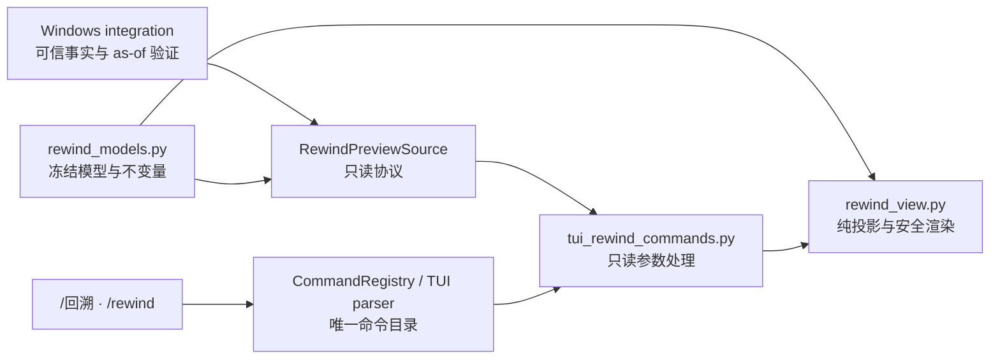
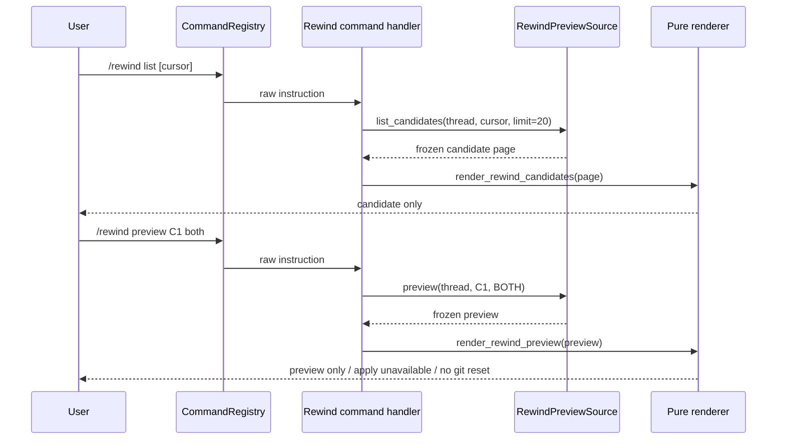

# Rewind Interfaces 设计

**日期：** 2026-07-19
**状态：** 已批准方案 A
**上游设计：** `2026-07-17-trustworthy-arbitrary-checkpoint-rewind-design.md`
**上游路线图：** `2026-07-17-trustworthy-arbitrary-checkpoint-rewind-roadmap.md`

## 目标

在 Interfaces Feature 内提供可信但严格只读的 checkpoint rewind 表达层：

- 冻结 conversation、code、both 三种预览模型；
- 将集成层已经验证的事实纯函数投影为 enabled 或稳定 disabled 预览；
- 安全、有界地渲染 checkpoint 候选和预览；
- 注册 `/回溯`、`/rewind`，只委托注入的 `RewindPreviewSource`；
- 明确显示 `preview only`、`apply unavailable` 和 `no git reset`。

本阶段不查询 Sessions、不读取 workspace、不加载 snapshot、不调用 Git、
provider、dispatcher 或 approval，也不实现任何 apply、恢复、删除或历史重写。

## 已批准方案

采用“结构门禁先行，再实现纯 Interfaces”的方案 A。

### 结构前置

Interfaces 当前功能基线为 106 项测试通过，但存在三处既有 Python 粒度违规：

- `tests/test_windows_tui.py` 为 382 行；
- `windows_tui.py::_handle_command` 为 69 行；
- `tests/test_terminal_state.py::test_restore_projects_persisted_thread_state`
  为 59 行。

先以独立、行为保持的提交消除这些违规：

1. 将终端 renderer 测试移动到专用测试文件；
2. 将大型 terminal-state 测试 fixture 提取为有界 helper；
3. 按现有 builtin/MCP handler 模式拆分 `_handle_command` 的纯分派逻辑。

结构前置不得改变命令语义、事件顺序、显示文本或服务可用性。完成后必须保持
Interfaces 106 项基线测试通过，并使全 Feature 文件不超过 300 行、函数不超过
50 行。

### 未采用方案

- 不接受带着历史结构红灯直接实现 rewind，因为届时无法如实声明 Feature gate
  通过。
- 不放宽 `AGENTS.python.md` 的 300/50 约束，也不为旧文件建立豁免。

## 架构



依赖方向只能从命令层指向纯模型和纯 view。Interfaces 不导入 Sessions 或
Workspace 的 rewind 实现；后续 `code_agent_win` runtime 显式完成层间映射。

## 组件

### `rewind_models.py`

定义稳定枚举：

- `RewindKind`: `conversation`、`code`、`both`；
- `RewindDisabledReason`: 按批准顺序固定 11 个 wire value：
  `checkpoint-not-found`、`message-bound-missing`、
  `message-bound-invalid`、`code-coverage-unavailable`、
  `code-journal-incomplete`、`pending-workspace-mutation`、
  `snapshot-missing`、`snapshot-invalid`、`workspace-conflict`、
  `preview-limit-exceeded`、`source-changed-during-preview`。

定义冻结记录：

- `RewindAsOf`
- `RewindPath`
- `RewindFacts`
- `RewindPreview`
- `RewindCheckpointCandidate`
- `RewindCheckpointPage`

并定义只读 `RewindPreviewSource` protocol，仅包含：

- `list_candidates(thread_id, *, cursor=None, limit=20)`
- `preview(thread_id, checkpoint_id, kind)`

协议不包含 apply、restore、confirm 或 mutation 方法。

### 模型不变量

- sequence 为 `None` 或非负真整数；拒绝 `bool`；
- coverage generation 为 `None` 或正整数；
- digest 为 `None` 或 64 位小写 SHA-256；
- 时间必须带时区并规范化为 UTC；
- ID、label、path、provenance 为非空且最长 512 字符；
- path 为 canonical relative POSIX path，不接受绝对路径、反斜杠、空段、
  `.`、`..` 或 NUL；
- conversation count 为非负真整数；
- tuple 字段拒绝可变 sequence，元素类型必须准确；
- code path 和 candidate ID 不重复；
- candidate page 最多 100 项，opaque cursor 最长 1024 字符，Interfaces
  不解码、不重编码；
- disabled reasons 去重，并按枚举固定优先级排序；
- `enabled == not disabled_reasons`；
- `requires_confirmation == enabled`，但这只描述未来 apply 的安全条件，
  不触发当前 approval；
- `apply_available` 和 `requires_git_reset` 永远为 `False`；
- conversation facet disabled 时 count 必须为 0；
- code facet disabled 时 paths 必须为空，不能把部分结果冒充完整结果。

### `rewind_view.py`

公开三个纯函数：

- `build_rewind_preview(kind, facts)`
- `render_rewind_preview(preview, *, max_path_rows=20)`
- `render_rewind_candidates(page, *, max_items=20)`

投影规则：

- conversation 只消费 conversation disabled reason；
- code 只消费 code disabled reason；
- both 合并适用原因，去重并按固定全局顺序排列；
- code 失败不禁用 independently-valid conversation；
- message-bound 失败不禁用 independently-valid code；
- 事实完整时，0 messages 和 0 paths 都是 enabled；
- candidate 的 `has_message_bound`、`has_code_anchor` 只是历史 facet，不是
  availability 承诺。

渲染固定为稳定英文技术文本，避免本阶段扩大 i18n catalog：

```text
rewind · preview only
checkpoint: <id> · <label>
kind: <conversation|code|both>
as of: <UTC time> · message=<n|-> · event=<n|-> · mutation=<n|-> · coverage=<n|-> · paths=<digest|->
conversation messages: <count|unavailable>
code paths: <count>
pre-agent baselines preserved: <count>
- <path> · baseline <provenance> · preserves pre-agent baseline
... <N> paths hidden
state: enabled|disabled · <stable reasons>
confirmation required: yes|no
apply unavailable
no git reset
```

候选输出固定包含 `candidate only`、ID、UTC time、label、message-bound/code
anchor facet、hidden count 和 opaque next cursor。

所有不可信 ID、label、path、provenance、cursor 先经过现有 `safe_text`，再压成
单行；不得允许换行伪造状态行。事实总数按原 tuple 计算，不因清洗后的显示文本
相同而变化。

渲染参数只接受 0–20 的真整数。`None` observation 字段显示 `-`，不能显示
`0`。conversation disabled 时显示 `unavailable`，不能把适配用的 0 描述为
可信零消息。

### `tui_rewind_commands.py`

定义冻结结果：

```python
RewindCommandResult(
    handled: bool,
    display_kind: DisplayKind,
    text: str,
)
```

公开：

```python
handle_rewind_command(
    source: RewindPreviewSource,
    thread_id: str | None,
    instruction: str | None,
) -> RewindCommandResult
```

支持：

- `列表` / `list`，可带一个 opaque cursor；
- `预览` / `preview`，必须显式提供 checkpoint ID 和
  `conversation|code|both`；
- 中文 action 与英文 kind 可以混用，因为 action 只决定操作、kind 使用固定
  wire value；
- 参数由现有 `shlex` 解析，带空格的 quoted token 保持为单参数；
- 不自动选择最新 checkpoint；
- list 始终以 `limit=20` 委托，cursor 原样传递。

稳定错误：

- `rewind requires a current thread`
- `rewind expects list [cursor] or preview <checkpoint-id> <conversation|code|both>`
- `rewind list expects at most one cursor`
- `rewind preview expects <checkpoint-id> <conversation|code|both>`
- `rewind kind must be conversation, code, or both`
- `rewind source is unavailable`

成功结果使用 `DisplayKind.METADATA`，使用错误或 source 异常使用
`DisplayKind.ERROR`。source 异常不得泄漏异常类型或文本。

### 命令注册

在唯一 `CommandRegistry` 增加：

- 名称 `回溯`
- alias `rewind`
- service requirement `rewind`
- actions `列表/list [cursor]`、`预览/preview
  <checkpoint-id> <conversation|code|both>`

`TuiCommandKind` 增加 `REWIND`，通用 parser 只保留 raw instruction，不解析业务
参数。`available_services(app)` 仅在 `app.rewind` 非空时报告服务。默认 parser
service 集不包含 rewind，避免未注入 source 时误显示命令。

本阶段不修改 `windows_tui.py` 来执行 rewind；后续 integration 通过已有
`ModeAwareWindowsTerminalApp` 扩展点注入 source 并追加 handler 结果。

## 数据流



候选列表不承诺可用性。只有 source 的 preview 调用可以返回 enabled 或稳定
disabled 结论。

## 错误与信任边界

- 不存在 current thread 时不调用 source；
- 非法 action、arity 或 kind 时不调用 source；
- source 错误转为稳定、脱敏的 in-band UI 错误；
- renderer 不捕获或解释 Sessions/Workspace 异常；
- Interfaces 不自行推断 checkpoint、snapshot、journal 或 path 冲突；
- enabled preview 不是 authorization token；
- 不产生 confirmation request、ActionRequest、Git command 或文件写入。

## 测试策略

### 结构前置

- 先运行现有 Interfaces 106 项作为 RED/characterization 基线；
- 每次机械拆分后运行对应测试和全 Interfaces；
- 最终运行全 Feature AST 门禁，要求文件 ≤300 行、函数 ≤50 行。

### 纯模型

- stable enum wire values；
- frozen、UTC、digest、count、sequence、tuple、path、cursor 边界；
- duplicate path/candidate 和 partial disabled facts；
- enabled/confirmation/fixed-false flags；
- protocol 明确没有 apply。

### 投影与渲染

- conversation/code/both facet 隔离；
- disabled reason 稳定排序；
- 0-change enabled；
- preview-only/footer 固定语义；
- ANSI/control/newline 清洗；
- 20 行上限与精确 hidden count；
- `None` 不变成 0；
- candidate facet 不被渲染为 availability。

### 命令

- 中英文 command/action 等价；
- service gating；
- raw instruction、quoted token 和 opaque cursor 原样委托；
- 无 thread、非法 action/kind/arity 的稳定错误；
- source 异常脱敏；
- 不自动选择 checkpoint；
- handler 签名和调用图不含 controller/provider/dispatcher/approval。

### Feature gate

- Interfaces 全量测试；
- `compileall`；
- 全 Feature AST 300/50；
- import/type-hint/cycle 探针；
- `git diff --check` 和干净工作树；
- 独立规格审查与质量审查。

## 提交边界

1. 行为保持的 Interfaces 结构拆分；
2. 冻结 rewind 模型与只读协议；
3. 纯投影与有界安全渲染；
4. `/rewind` 注册、解析与只读委托；
5. Interfaces Units 契约更新与 Feature gate。

每项先 RED/characterization，再最小 GREEN，单独提交并接受规格/质量审查。

## 延后到 Integration

以下内容不进入 Interfaces Feature：

- Sessions candidate/observation 到 Interfaces 模型的映射；
- snapshot handle、artifact、journal continuity、foreign overlap 和 current-tip
  验证；
- as-of source move 重试；
- `RewindRuntime`、gate、capture coordinator 和 checkpoint ordering；
- `ModeAwareWindowsTerminalApp` 注入和实际命令显示；
- apply、approval、文件恢复、消息裁剪、Git reset/checkout/index/HEAD 操作。
