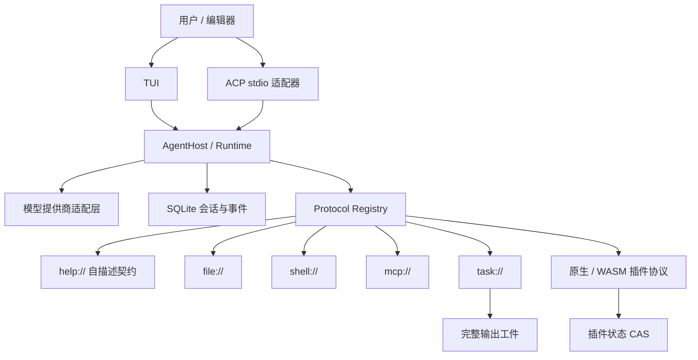
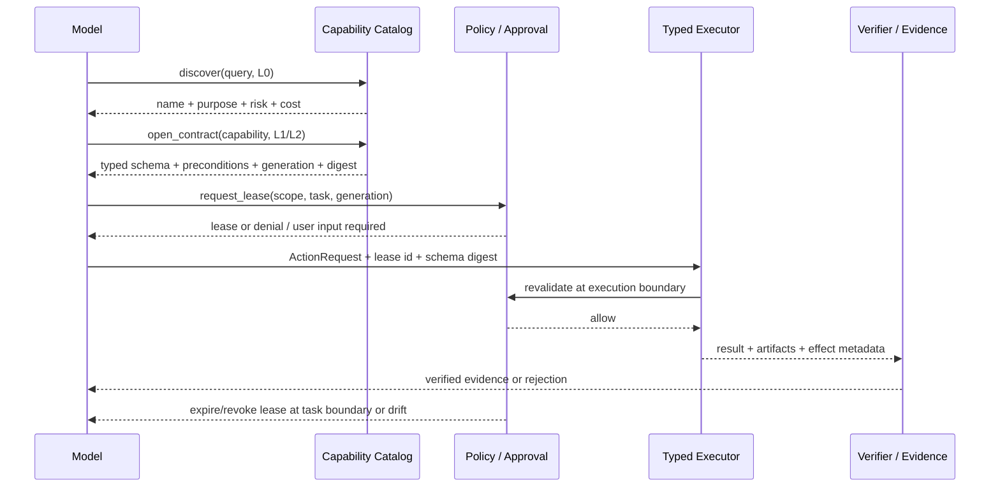

# URI Agent 项目拆解与 Chaos Agent 借鉴报告

> 审计日期：2026-09-02
> URI Agent 审计基线：`b36f806db5ef3836ecdfa5063959f9c503d1e232`（`main`）
> Chaos Agent 对照基线：`6252b1fc61e2b13ec2d206428e8ca91da41be0b0`（本地 `main`，审计时领先远端 3 个提交）
> 审计方式：公开仓库源码、文档、提交历史、发布页和 CI 的只读静态审计；未安装依赖、未运行 URI Agent、未登录任何服务，也未改动 Chaos Agent 代码。

## 一、执行结论

URI Agent 不是一个“把工具改成 URI 写法”的小玩具，而是一个已经形成完整产品骨架的 Rust Agent：它把文件、Shell、MCP、任务、技能和插件统一成可读取帮助、再执行动作的协议空间，并把 TUI、会话持久化、多模型提供商、ACP 接入和 WASM 插件装进同一运行时。按源码快照统计，仓库约 8.2 万行 Rust、87 个 Rust 文件、624 个测试标记；从 2026-08-21 首次提交到本次审计基线仅约 12 天，已有 245 个提交和 21 个标签。这说明开发强度高，但也意味着接口和安全假设仍处于快速变化期。

对 Chaos Agent 最值得借鉴的不是 `read(uri)` / `exec(uri)` 这两个表面 API，而是背后的**渐进式能力披露**：模型启动时不携带全部工具 schema，需要时才读取某个能力的契约。它能直接缓解 Chaos Agent 当前“工具定义随上下文常驻”的 token 压力，并能与现有 L0/L1/L2 仓库语义上下文形成一致的认知模型。

但不建议整体移植 URI Agent，也不建议因此重写 Rust。Chaos Agent 已经在中央策略、显式审批、技能内容摘要冻结、动作证据、有限循环、事务式编辑和 Windows 进程所有权方面建立了更强的安全语义；URI Agent 的插件权限只是声明/审计标记，WASM 明确不是安全沙箱，会话中的技能又只冻结路径身份而非完整内容。直接照搬会倒退。

本报告给出的首选方向是一个组合创新：

> **证据绑定的渐进能力租约（Progressive Capability Leasing, PCL）**
> 先发现能力，再按需展开契约；策略层根据风险签发有范围、有期限、有代次的租约；执行仍走强类型 `ActionRequest`；完成后由验证器绑定证据，租约随任务边界失效。

这不是把 Chaos Agent 变成 URI Agent，而是把 URI Agent 的低上下文成本、ACP 的互操作性、MCP 的生态能力，与 Chaos Agent 已有的权限和证据闭环合并起来。

## 二、审计边界与证据等级

| 等级 | 本次使用的证据 | 能支持什么结论 | 不能支持什么结论 |
|---|---|---|---|
| A | 固定提交源码、测试代码、CI 配置 | 架构、控制流、默认值、安全边界、测试覆盖意图 | 真实线上稳定性、性能、全部测试实际通过 |
| B | GitHub 最新 CI 成功记录、发布页 | 指定提交的工作流已成功、存在可下载发布物 | 所有平台/提供商在用户环境可用 |
| C | README/项目文档声明 | 作者设计意图、支持矩阵声明 | 独立验证后的兼容性或安全性 |
| D | 本地 Chaos Agent 固定提交源码 | 两套设计的当前差异 | 未执行的性能收益和未来路线效果 |

URI Agent 最新审计提交对应的公开 CI 显示测试工作流成功，Linux、Windows 和 macOS 平台测试任务均完成；这一点只证明该工作流状态，不等于本文做过独立运行验收。[CI 运行记录](https://github.com/4fuu/uri-agent/actions/runs/33591847453) ｜ [仓库](https://github.com/4fuu/uri-agent) ｜ [发布页](https://github.com/4fuu/uri-agent/releases)

README 中关于 5/9 类 API、1073/1274 个模型目录条目、35/39 个提供商 ID 和 28/35 个实时发现能力的数字，均应视为项目自述，本文没有逐一调用提供商验证。

## 三、它到底做了什么

### 3.1 总体架构

核心思想可概括为三层：

1. **协议注册层**：每个能力用唯一 scheme 注册，并提供 `read`、`exec` 和 `help` 契约；地址只在第一个 `://` 处分割，余下部分由具体协议解释。
2. **运行时层**：负责模型调用、工具分派、任务、压缩、重试、会话事件和提供商适配。
3. **接口/扩展层**：TUI 和 ACP 是外部接口；MCP、原生插件与 WASM 是能力扩展方式。

源码入口可见 [`src/protocol.rs`](https://github.com/4fuu/uri-agent/blob/b36f806db5ef3836ecdfa5063959f9c503d1e232/src/protocol.rs)、[`docs/protocols.md`](https://github.com/4fuu/uri-agent/blob/b36f806db5ef3836ecdfa5063959f9c503d1e232/docs/protocols.md) 和 [`docs/development.md`](https://github.com/4fuu/uri-agent/blob/b36f806db5ef3836ecdfa5063959f9c503d1e232/docs/development.md)。

### 3.2 八个关键设计

#### 1. 两个原语承载大量能力

模型面向的基本接口是 `read(uri, body)` 与 `exec(uri, body)`，复杂工具通过目标 scheme 的帮助文档解释参数。其价值不是 API 数量少本身，而是把“能力目录”和“完整参数契约”拆开：模型只有需要某项能力时才支付完整 schema 成本。

**创新度：高。** 多数 Agent 框架把全部工具 schema 一次塞进提示词；URI Agent 把工具调用变成“发现—读契约—调用”。
**代价：** 它把编译期/结构化 schema 的一部分清晰度转移成字符串协议、帮助文档和额外回合；复杂嵌套参数仍然需要 `_json` 等旁路，不能宣称 URI 天然比 typed tools 更可靠。

#### 2. MCP 被包装为可懒加载的协议空间

每个 MCP server 形成自己的 scheme；服务连接可以延迟建立，工具列表和 schema 只在查询时展开，查询体优先映射 `_body`，复杂参数可走 `_json`。这比“启动时把所有 MCP 工具注入模型”更适合工具数量大的环境。

**可借鉴：高。** Chaos Agent 当前保留完整 typed MCP tool definitions，可以把“目录可见”和“schema 激活”拆开。
**限制：** 源码仍留有 MCP OAuth 未实现项；接入 Streamable HTTP 之前必须先把认证、header 脱敏和会话存储边界补齐，不能只抄懒加载。

#### 3. 会话采用追加事件和可丢弃索引

消息、调用、结果和压缩都追加到 SQLite 事件流；resume index 带校验，可损坏后从事件重建。原始事件保留，压缩主要改变后续模型视图而不是销毁历史。这是比“只存最后一份消息数组”稳健得多的恢复模型。

**可借鉴：中。** Chaos Agent 已有任务、检查点和证据对象，不需要替换成 URI Agent 的数据库；可以吸收“权威事件 + 可重建投影”的原则。
**限制：** URI Agent 没有证明跨版本事件迁移策略，`sessions-v3` 文档反而明确没有旧格式迁移承诺。

#### 4. 会话冻结与运行时可变配置分离

启动时的系统提示、协议清单、技能名/描述/规范路径和 MCP 身份会冻结；提供商和部分连接配置可在调用时重新解析。这正确地区分了“保证重放一致性的身份”和“必须轮换的运行配置”。

**可借鉴：中高。** 适合扩展成 Chaos Agent 的 catalog generation。
**关键缺口：** 技能冻结的是规范路径和已生成的启动上下文，不是路径下所有未读资源的内容摘要。同一路径内容被替换后，恢复会话可能读取新字节。Chaos Agent 当前对技能保存 digest，并在恢复时检查漂移，安全性更强。

#### 5. 工具结果、任务和完整输出被对象化

前台 Shell 约 60 秒仍未结束时可转为 managed task；过大的输出保存到输出目录，并只把预览与 `file://` 引用交给模型。它有效控制上下文膨胀，也让长任务可以被观察。

**可借鉴：高，但必须改语义。** “完整输出工件 + 截断预览 + 显式读取”很适合 Chaos Agent。
**不应照搬：** 前台命令自动后台化会模糊“工具调用已返回”和“外部效果已完成”。Chaos Agent 的任务证据和不可重复副作用要求更严格；应由用户/策略显式选择 detach，并为输出工件设置 TTL、脱敏和捕获上限。

#### 6. 插件同时支持原生协议和 WASM

插件 ABI 严格校验 descriptor，支持整组原子 reload、CAS 状态、resident callback 与 agent callback。WASM 层设置模块大小、manifest、响应、线性内存和 fuel 上限。

**工程性：强。安全创新：有限。** Fuel/内存上限防止一部分资源滥用，但文档明确权限声明只是审计标记，WASM 被授予文件系统、HTTP 与 host calls，运行权限等同主进程，不构成可靠安全沙箱。[插件文档](https://github.com/4fuu/uri-agent/blob/b36f806db5ef3836ecdfa5063959f9c503d1e232/docs/plugins.md)

Chaos Agent 的 declarative plugin 虽然灵活度较低，但所有动作经中央策略评估，且不允许插件直接运行 Python、Shell 或 URL，更符合当前产品的威胁模型。现阶段不应为了“生态丰富”引入可执行 WASM。

#### 7. ACP 把 Agent 接到编辑器生态

URI Agent 支持 ACP v1 stdio，不启动 TUI；按项目建立运行时，并能复用已经创建的会话。这使 Agent 不再绑定自己的 UI，是项目里最具外部扩张价值的部分之一。[URI Agent ACP 文档](https://github.com/4fuu/uri-agent/blob/b36f806db5ef3836ecdfa5063959f9c503d1e232/docs/acp.md)

**可借鉴：高。** 对 Chaos Agent 而言，ACP 更适合作为薄适配器：会话、审批、执行和证据仍由核心拥有。首版可只开放 read-only / plan 能力，再逐步开放受策略保护的 edit/exec。

#### 8. 工程发布速度快，供应链基础不错

CI 覆盖 Linux fmt/clippy/test/check，以及 Windows、macOS 测试；release workflow 构建多平台产物、校验版本、生成 checksum 并做安装器 smoke test，GitHub Actions 依赖固定到完整提交 SHA。

**优点：** 发布链条已成形。
**风险：** 暂未看到 `SECURITY.md`、`CONTRIBUTING.md`、威胁模型、依赖安全审计、模糊测试或覆盖率门槛。代码也高度集中在少数大文件中，例如 runtime、controller、render、MCP 和 session 均在数千行规模。结合项目历史很短、人工提交主要集中于单一作者身份，当前更适合研究和受控试用，不宜直接当作高权限生产执行器。

## 四、与 Chaos Agent 的逐项比较

| 维度 | URI Agent | Chaos Agent 当前形态 | 判断 |
|---|---|---|---|
| 模型侧工具成本 | 按 URI 读帮助、渐进披露 | 完整 typed tool schema 常驻上下文 | URI 思路值得引入 |
| 执行类型安全 | 通用 `read/exec` + 文档约定 | typed `ActionRequest` 与专用模型 | 保留 Chaos 执行层 |
| 中央权限 | 插件声明偏审计，主进程权限大 | 统一 policy/approval，未知或关键动作 fail closed | Chaos 更强 |
| 技能一致性 | 冻结身份、路径和启动快照 | source/digest 激活，漂移时移除/拒绝恢复 | Chaos 更强 |
| 循环资源上限 | 无固定 tool round 上限；部分重试组合理论上可额外尝试 42 次 | 默认有限轮次、工具调用和 token 预算 | Chaos 更可控 |
| 长任务 | managed task、自动后台化、输出引用 | 前台持久任务，强调进程所有权；无通用 daemon | 借对象，不借自动 detach |
| 恢复 | SQLite 追加事件 + 可重建索引 | task/checkpoint/evidence + 内容寻址/回滚 | 可互相补强 |
| 多文件编辑 | transactional apply_patch，提交失败回滚 | 精确计划、CAS、审批 Diff、崩溃恢复、owned-only rollback | Chaos 语义更完整 |
| 验证 | CI 和工具结果驱动 | 独立 verifier，拒绝模型自报成功，证据会失效 | Chaos 更强 |
| MCP | 丰富的 lazy bridge，支持更多 transport | approved stdio、generation snapshot、policy bridge | 合并两者优势 |
| IDE 互操作 | 已实现 ACP v1 | 未见 ACP 适配 | Chaos 明显缺口 |
| 插件灵活性 | 原生 + WASM + resident | 声明式、不可直接执行任意代码 | URI 更灵活，Chaos 更安全 |
| 跨平台 | Rust 单二进制，多平台发布 | Windows-first，共享 Python 核心 + 少量 OS 适配 | 不构成重写 Rust 的理由 |

结论不是谁“更先进”，而是两者优化目标不同：URI Agent 追求**统一与扩展性**，Chaos Agent 追求**高权限操作的可控性、可恢复性和可证明性**。最佳组合应保留后者的执行内核，只把前者的发现层和互操作层引入。

## 五、建议借鉴清单

### P0：收益高、与现有架构相容

#### A. 能力契约虚拟化

把现有工具目录拆成三层：

- L0：`name / description / risk / cost / namespace`，始终可见；
- L1：用途、前置条件、常见示例、输出/失败语义，按需读取；
- L2：完整 typed schema、资源说明、审批规则，激活后注入下一次模型边界。

模型可通过一个只读的 `open_capability_contract` 请求展开能力，但不能绕过 `ActionRequest` 直接执行。这样可以取得 URI Agent 的上下文收益，而不牺牲 Chaos Agent 的类型和策略边界。

#### B. ACP 薄适配器

先实现最小 ACP server：项目发现、会话创建/恢复、prompt、流式输出、read-only tools 和审批转发。编辑器发来的动作仍映射到 Chaos Agent 内部任务和 policy；ACP session id 不直接成为权限主体。

ACP 官方架构把编辑器与 Agent 通过本地 JSON-RPC/stdio 解耦，并把权限请求作为双向协议的一部分，这与 Chaos Agent 的审批模型兼容。[ACP 架构](https://agentclientprotocol.com/get-started/architecture)

#### C. MCP 懒目录 + typed 激活

连接仍按 approved server 和 generation 冻结；启动只注入 MCP server/tool 摘要，用户或模型展开后才取 schema。增加 Streamable HTTP 时，OAuth、header 脱敏、secret reference 和审计日志必须与 transport 同时交付。

#### D. 大输出工件化

把超限 stdout/stderr、扫描结果和大型 diff 保存为 task-owned artifact，模型只收摘要、范围、内容类型和读取句柄。必须补充：敏感信息过滤、最大捕获量、TTL、显式保留、任务归属和访问审计。

### P1：先设计，再实现

- **权威事件 + 可重建投影**：将任务状态、checkpoint、证据索引视为投影，损坏后由不可变事件重建；不要更换现有内容寻址对象。
- **插件状态 CAS**：给声明式插件提供命名空间小状态，更新要求 expected revision，避免并发丢写。
- **协议契约测试**：借鉴 URI Agent 对 help、descriptor 和 ABI 的严格验证，为 Chaos capability contract 增加 schema 快照和兼容性测试。
- **显式后台任务**：仅对用户/策略批准的可重入命令开放 detach；恢复后必须能区分 running、lost、cancelled 和 effect-unknown。

### 不建议借鉴

1. 不把所有复杂工具都改成字符串 URI；复杂写操作继续用 typed schema。
2. 不引入拥有主进程文件/网络权限的第三方 WASM 或 resident callback。
3. 不以路径代替内容摘要冻结技能、插件和契约。
4. 不允许无总轮次/总耗时/总费用上限的 agent loop 与交错重试。
5. 不把前台调用“自动转后台”视为成功返回。
6. 不在 SQLite 会话私有记录中落明文 token、header 或环境变量值。
7. 不因 URI Agent 使用 Rust 就重写 Chaos Agent；只有 profiling 证明的性能热点或明确的强隔离边界，才考虑 Rust/PyO3 小模块。

## 六、URI Agent 暴露出的盲区

| 盲区 | 证据/机制 | 可能失败方式 | 对 Chaos 的约束 | 采用前必须验证 |
|---|---|---|---|---|
| “权限”不是隔离 | 插件文档明确为 audit marker；WASM 有 FS/HTTP/host calls | 恶意或有缺陷插件读取、覆盖工作区或外传数据 | 可执行扩展必须进独立低权限 worker | AppContainer/受限令牌、网络策略和逃逸测试 |
| 技能只冻结路径身份 | 会话快照保留 canonical path，资源可从冻结位置继续加载 | 同路径内容漂移导致恢复结果不一致 | 继续使用 digest/source approval | 修改同路径内容后的恢复必须 fail closed |
| 循环成本无总闸 | 无固定 tool round 上限；按错误类别分别重试 | 交错错误造成延迟和费用放大 | 保留总轮次/调用/token/时间预算 | 混合 429/5xx/stream failure 故障注入 |
| 私有会话可能含明文 MCP 配置 | ACP 文档依赖文件系统权限保护 private records | 本地数据库泄露或被其他进程读取 | secret 只存引用，不进事件 | 静态扫描、备份/导出和崩溃转储检查 |
| 任务返回语义含糊 | 长前台任务可自动转 managed task | 模型误判外部副作用已完成并重复执行 | `accepted != completed != verified` | 不可重入命令中断/恢复/重复调用测试 |
| MCP 认证未闭环 | 源码保留 OAuth TODO | HTTP MCP 在企业环境无法安全续期 | transport 与 auth 同时设计 | token 轮换、401、撤销、日志脱敏 |
| ABI 与数据迁移早期 | ABI v6 严格且无向后兼容；sessions-v3 无迁移承诺 | 插件或会话随快速升级失效 | capability schema 需版本兼容策略 | N-1 升级、降级、旧任务恢复测试 |
| 工程集中度高 | 多个核心文件 3k–6k 行，主要人工提交集中 | review 困难、隐性耦合、关键人风险 | 只借机制，不复制实现结构 | 模块边界、变更热点和 mutation/fuzz 结果 |

## 七、项目之外值得吸收的创新

### 7.1 ACP 代理链：把扩展点放在接口边界

ACP 的 proxy-chain RFD 提议让中间代理注入上下文、工具、子 Agent 或 hook，而不修改 Agent 核心。它尚是提案，不应当作稳定标准，但对 Chaos Agent 的启发很明确：审计、脱敏、企业策略和遥测可以成为 ACP 边界中间件，而不是散落在模型 loop 中。[ACP Proxy Chains RFD](https://agentclientprotocol.com/rfds/proxy-chains)

另一个 MCP-over-ACP RFD 探索通过现有 ACP 通道注入 MCP 能力，避免编辑器与 Agent 旁边再建一条不透明 side channel。也应标注为提案而非已稳定能力。[MCP over ACP RFD](https://agentclientprotocol.com/rfds/mcp-over-acp)

### 7.2 MCP 的“待输入任务”和 Elicitation

2026 年 MCP 路线已经在推进 task 扩展、`input_required`、header routing，以及结构化/URL elicitation。它比 Agent 自己在自然语言里猜“需要用户补什么”更适合长任务和 OAuth 流程。Chaos Agent 可以把 `input_required` 映射成现有任务状态，把 elicitation 作为受控用户输入通道；表单不得请求 secret，URL 模式必须有来源展示与用户确认。[MCP 2026 更新](https://blog.modelcontextprotocol.io/posts/2026-07-28/) ｜ [Elicitation 规范草案](https://modelcontextprotocol.io/specification/draft/client/elicitation)

### 7.3 Windows AppContainer：真正的低权限执行边界

如果未来必须运行第三方扩展，最值得投入的不是再加一层 manifest 声明，而是把它放进独立进程、受限文件能力和默认无网络的 AppContainer。微软的模型把文件、注册表、网络和进程访问放在 capabilities/ACL 边界上，才接近安全隔离。[Microsoft AppContainer isolation](https://learn.microsoft.com/en-us/windows/win32/secauthz/appcontainer-isolation)

Wasmtime 自身能隔离 WebAssembly 内存与未导入的 host 能力，但一旦宿主主动提供广泛 WASI、目录和 HTTP 接口，系统安全性仍取决于这些 capability 的最小化；不能用“WASM”三个字代替威胁模型。[Wasmtime Security](https://docs.wasmtime.dev/security.html)

### 7.4 工作流事件历史：把恢复从“续写消息”升级为确定性重放

Temporal 的核心启发不是引入它的服务，而是命令与 Event History 对照、崩溃后从历史恢复确定性状态。Chaos Agent 可在本地借用这一原则：外部副作用先产生意图事件和幂等键，完成后再写结果/证据事件；恢复器必须处理 `effect-unknown`，而不是简单重发。[Temporal Workflow Execution](https://docs.temporal.io/workflow-execution) ｜ [Event History](https://docs.temporal.io/encyclopedia/event-history)

### 7.5 签名与证明：能力包不仅要有 hash，还要知道是谁构建的

Chaos Agent 已有 digest，可以进一步参考 Sigstore：插件/能力包携带签名、构建身份和 attestation；缺少证明时 fail closed。首期不必建设公共透明日志，但应预留 signer、predicate、bundle 和 offline verify 字段。[Cosign verification](https://docs.sigstore.dev/cosign/verifying/verify/) ｜ [Attestation verification](https://docs.sigstore.dev/cosign/verifying/attestation/)

## 八、推荐的新架构：证据绑定的渐进能力租约

一个租约至少应绑定：

- `task_id / thread_id`；
- `catalog_generation`；
- `capability_id + schema_digest`；
- 工作区、路径、命令或远端主机范围；
- 风险等级、是否需要用户审批；
- 最大调用次数、token/时间/输出预算；
- 过期条件和撤销原因；
- 期望证据类型。

其独创性在于把三条通常分离的链合为一条：

1. **渐进披露**控制认知成本；
2. **渐进授权**控制权限扩张；
3. **证据绑定**控制“是否真的完成”。

URI Agent 主要解决第 1 条；ACP/MCP 提供生态接口；Chaos Agent 已经拥有第 2、3 条的关键基础。三者组合后，才形成可以对外称为产品级创新的机制。

## 九、最小实验建议与验收门槛

以下只是建议，不是已经完成的结果。本次没有执行。

### 实验范围

只选择 6–10 个只读或低风险能力：文件读取、仓库搜索、诊断、测试发现、MCP 只读查询等。实现 L0 目录、L1/L2 契约、generation/digest、激活记录和 typed execution 映射；不改写原有工具实现，不接入第三方 WASM，不开放后台 daemon。

### 必须同时对照的基线

- 当前完整工具 schema 模式；
- PCL 渐进激活模式；
- 相同模型、相同上下文预算、相同 40 场景目录；
- 分开统计“目录总数”“实际执行数”“通过数”，不得把场景目录数写成通过数。

### 建议门槛

| 指标 | 建议通过条件 |
|---|---|
| 工具 schema token | 相对基线下降至少 50% |
| 安全场景 | 零新增越权、零审批绕过 |
| 总体任务质量 | 不低于基线；任何回归必须定位到契约发现、选择或执行层 |
| 激活开销 | 中位数不超过 1 个额外模型回合 |
| 重放确定性 | 同一 generation/digest 得到相同能力目录和 schema |
| 漂移处理 | schema、skill 或 plugin digest 改变时旧租约 fail closed |
| 证据闭环 | 工具返回不自动等于成功，仍须满足现有 verifier 要求 |

### 停止条件

出现以下任一项即停止推广：模型频繁选错同名能力；为省 token 而丢失关键前置条件；租约不能在执行边界复验；恢复任务混用新旧 schema；审批 UI 无法清楚展示最终 typed action。

## 十、建议的实施顺序（需您确认后才执行）

1. **P0-A：只做设计与测量**——统计当前真实工具 schema token 构成，定义 capability manifest 与 generation/digest，不改执行路径。
2. **P0-B：只读试点**——把 6–10 个能力接入 `open_capability_contract`，仍映射到原 typed tools。
3. **P0-C：回放验证**——跑现有场景集并输出逐场景差异；安全回归为硬阻断。
4. **P0-D：ACP read-only 原型**——只有前三步达到门槛才开始，先不开放 edit/exec。
5. **P1：MCP Streamable HTTP / 工件化**——在认证、脱敏和任务状态机设计通过评审后分别实施。

我建议您确认的第一步不是“直接开发完整功能”，而是下面这份受限任务：

> 在 `chaos-agent` 中做一次只读的 PCL 可行性设计与基线测量：盘点当前工具 schema 的真实 token 构成，定义 L0/L1/L2 capability manifest、catalog generation、schema digest 和 lease 数据契约，给出 6–10 个低风险能力的映射样例与测试计划。不得改变现有执行器、策略判断、审批流程、插件机制和会话格式；不得运行外部网络或第三方代码；完成后先提交设计、测量结果和拟改文件清单，等待确认再实现。

## 十一、最终判断

- **可以借鉴，而且有实质价值：** 优先借鉴按需能力契约、MCP 懒 schema、ACP 薄适配和大输出工件。
- **不应照搬：** 通用 URI 执行面、非隔离 WASM、路径级冻结、无限制循环和自动后台任务。
- **Chaos Agent 可形成的差异化创新：** 不是“工具更少”或“协议更多”，而是让每次能力发现、授权、执行和验证都处在同一个 task/generation/evidence 约束内。
- **工程策略：** 保持 Python 控制面；Rust 仅用于经测量证明的热点或独立低权限 worker，不做证据不足的全量重写。
- **当前交付状态：** 报告已完成；代码未修改、功能未实现、实验未运行。下一步需要您的明确确认。

## 参考入口

- [URI Agent 仓库](https://github.com/4fuu/uri-agent)
- [协议设计](https://github.com/4fuu/uri-agent/blob/b36f806db5ef3836ecdfa5063959f9c503d1e232/docs/protocols.md)
- [会话设计](https://github.com/4fuu/uri-agent/blob/b36f806db5ef3836ecdfa5063959f9c503d1e232/docs/sessions.md)
- [上下文冻结](https://github.com/4fuu/uri-agent/blob/b36f806db5ef3836ecdfa5063959f9c503d1e232/docs/context.md)
- [插件与 WASM](https://github.com/4fuu/uri-agent/blob/b36f806db5ef3836ecdfa5063959f9c503d1e232/docs/plugins.md)
- [ACP 接入](https://github.com/4fuu/uri-agent/blob/b36f806db5ef3836ecdfa5063959f9c503d1e232/docs/acp.md)
- [开发与验证](https://github.com/4fuu/uri-agent/blob/b36f806db5ef3836ecdfa5063959f9c503d1e232/docs/development.md)
